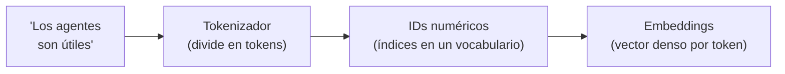
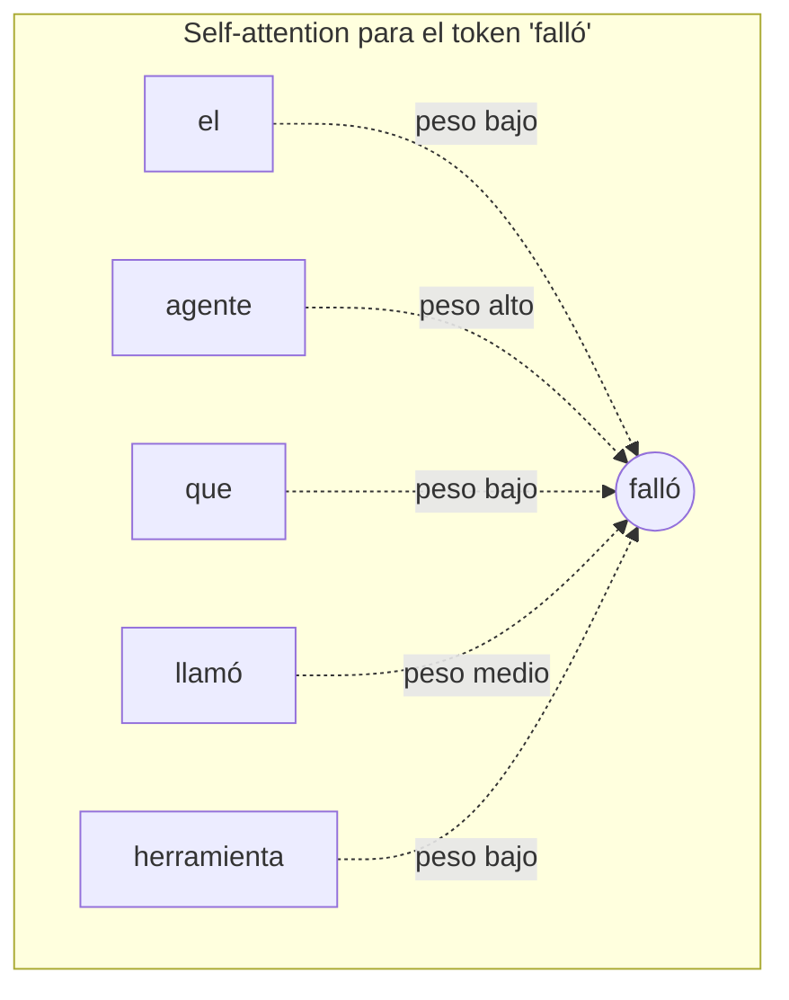
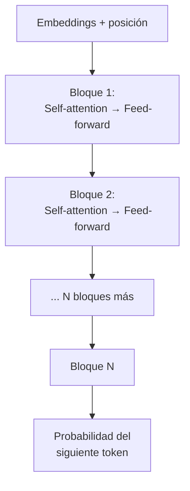

# Arquitectura de Transformers

!!! abstract "Tema central"
    Qué hay adentro del modelo que corre detrás de cada agente del curso. No hace falta este módulo para completar el curso — el [Módulo 0](../modulos/00-introduccion-general.md) ya da lo necesario para trabajar con LLMs a nivel de prompting y tool calling — pero entender el mecanismo interno ayuda a razonar mejor sobre por qué los modelos fallan de la forma en que fallan (límite de contexto, confusión con referencias lejanas, sensibilidad al orden de la información).

## Objetivos de aprendizaje

- [ ] Explicar qué hace un embedding y por qué el modelo no trabaja directamente con texto.
- [ ] Explicar, en términos simples, qué resuelve el mecanismo de *self-attention*.
- [ ] Explicar por qué hace falta información posicional además de la atención.
- [ ] Ubicar los bloques repetidos (atención + feed-forward) dentro de la arquitectura completa.

## De texto a números: tokens y embeddings

Antes de que el modelo pueda "razonar" sobre un texto, lo convierte en números:

Cada token se mapea a un **embedding**: un vector de cientos o miles de números que representa su significado en un espacio geométrico (ver el módulo [Embeddings y espacios vectoriales](embeddings.md) para el detalle de cómo funciona esa geometría). Estos embeddings son el punto de partida — todo lo que sigue son transformaciones sobre estos vectores.

## Self-attention: el mecanismo central

El problema que resuelve la atención: el significado de una palabra depende del contexto. En *"el agente que llamó a la herramienta falló"*, para saber qué "falló" hace falta relacionar esa palabra con "el agente", no con "la herramienta" — aunque "herramienta" esté más cerca en el texto.

**Self-attention** le permite a cada token "mirar" a todos los demás tokens de la secuencia y decidir, con un peso aprendido, cuánto le importa cada uno para entender su propio significado en ese contexto puntual.

Técnicamente, cada token genera tres vectores — *Query*, *Key* y *Value* — y la atención se calcula comparando el Query de un token contra los Keys de todos los demás, para obtener los pesos con los que se combinan los Values. Esto se repite en paralelo muchas veces (*multi-head attention*): cada "cabeza" puede aprender a prestar atención a un tipo de relación distinto (una cabeza para relaciones sujeto-verbo, otra para referencias, etc.).

!!! tip "Nodo dice"
    Si Query/Key/Value te suena a base de datos, no es casualidad: es literalmente la misma idea. El *Query* es "qué estoy buscando", los *Keys* son "etiquetas" de lo disponible, y el *Value* es "lo que me llevo" si hay match. Cada token, en paralelo, hace su propia mini-búsqueda sobre todos los demás tokens.

!!! tip "Por qué esto explica comportamientos reales del agente"
    Cuando un agente "pierde el hilo" en una conversación muy larga, una parte del problema es literalmente esto: hay más tokens compitiendo por la atención del modelo, y las relaciones importantes pueden diluirse. Es una de las razones técnicas detrás del "contexto contaminado" del [Módulo 3](../modulos/03-memoria-y-estado.md).

## Embeddings posicionales: por qué el orden importa

La self-attention, tal como se describió arriba, no distingue por sí sola el *orden* de los tokens — "el perro mordió al cartero" y "el cartero mordió al perro" tendrían la misma atención entre palabras si no se agrega información de posición. Por eso se suma a cada embedding una señal de **posición** (codificada matemáticamente, ej. con funciones seno/coseno en la arquitectura original, o variantes más modernas como RoPE en los modelos que usa este curso vía Ollama).

## La arquitectura completa: una pila de bloques

Cada bloque combina self-attention (mezcla información entre tokens) con una red feed-forward (procesa cada token individualmente), más conexiones residuales y normalización que estabilizan el entrenamiento. Los modelos que usa el curso (Llama, Qwen, Mistral vía Ollama) son **decoder-only**: apilan docenas de estos bloques y en cada paso predicen un único token siguiente, usando todo lo generado hasta ahí como contexto — exactamente el mecanismo de "inferencia" del [Módulo 0](../modulos/00-introduccion-general.md), visto ahora por dentro.

## De la arquitectura al comportamiento de agente

| Lo que pasa por dentro | Por qué importa para un agente |
|---|---|
| El contexto tiene un límite de tokens fijo | Define cuánta memoria/historial cabe en una sola llamada — tema central del [Módulo 3](../modulos/03-memoria-y-estado.md). |
| La atención pondera todos los tokens entre sí | Instrucciones puestas al final del prompt suelen pesar más que las del principio en contextos largos — importa cómo se ordena un system prompt largo. |
| El modelo predice un token a la vez, autoregresivamente | Es la base técnica de por qué el streaming funciona (se puede mostrar cada token a medida que se genera) — tema del [Módulo 11](../modulos/11-produccion.md). |

## Videos recomendados

**[But what is a GPT? Visual intro to transformers](https://www.youtube.com/watch?v=yMQPQuz5WpA)** — 3Blue1Brown. Explica embeddings, atención y arquitectura completa con visualizaciones excelentes, sin sacrificar rigor. Tiene doblaje automático disponible en español.

Más videos sobre este tema:

| Video | Canal | Por qué verlo |
|---|---|---|
| [Attention in transformers, step-by-step](https://www.youtube.com/watch?v=eMlx5fFNoYc) | 3Blue1Brown | Profundiza en self-attention, multi-head attention y cross-attention — complemento directo del video de arriba. |
| [Let's build GPT: from scratch, in code, spelled out](https://www.youtube.com/watch?v=kCc8FmEb1nY) | Andrej Karpathy | Construye un transformer completo en código (self-attention, embeddings posicionales, feedforward, residuales). Denso (~2h) pero es la referencia definitiva para developers. |

## Checklist de cierre

- [ ] Puedo explicar con mis palabras qué hace la self-attention, sin usar la palabra "magia".
- [ ] Entiendo por qué hace falta codificar la posición además de la atención.
- [ ] Puedo conectar al menos dos comportamientos reales de un agente (Módulos 0-3) con un mecanismo interno del transformer.
