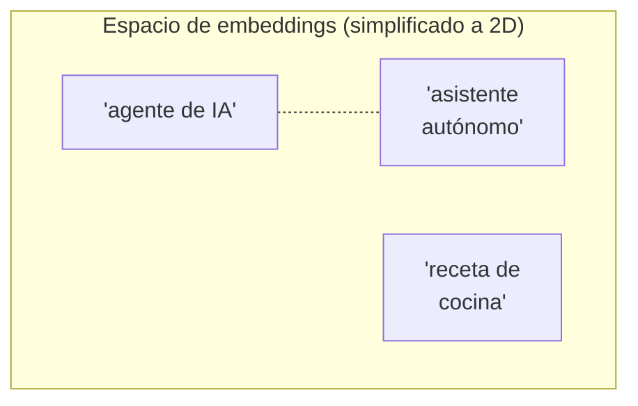
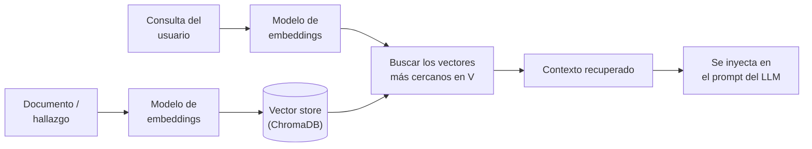

# Embeddings y espacios vectoriales

!!! abstract "Tema central"
    La base técnica del RAG que se usa desde el [Módulo 3](../modulos/03-memoria-y-estado.md): cómo se representa el *significado* de un texto como números, y cómo se mide si dos textos "quieren decir algo parecido" sin comparar palabra por palabra.

## Objetivos de aprendizaje

- [ ] Explicar qué es un embedding sin usar la palabra "vector mágico".
- [ ] Calcular a mano, conceptualmente, por qué la similitud coseno mide "parecido" y no "distancia".
- [ ] Conectar embeddings con lo que hace ChromaDB por debajo en el proyecto sincrónico.

## Qué es un embedding

Un **embedding** es una lista de números (un vector, típicamente de cientos de dimensiones) que representa el significado de un texto en un espacio geométrico. La idea central: textos con significado parecido quedan **cerca** en ese espacio, aunque no compartan ni una sola palabra.



*"agente de IA"* y *"asistente autónomo"* quedan cerca en este espacio (significado similar) aunque no compartan palabras; *"receta de cocina"* queda lejos de ambos. Esto es exactamente lo que permite que una búsqueda semántica encuentre el hallazgo de investigación correcto en el [Módulo 3](../modulos/03-memoria-y-estado.md) aunque la consulta esté redactada distinto al hallazgo guardado.

## Cómo se mide "parecido"

La métrica más común es la **similitud coseno**: mide el ángulo entre dos vectores, no su magnitud. Dos vectores que apuntan en la misma dirección son "parecidos" (similitud cercana a 1) sin importar qué tan largos sean.

```python
import numpy as np

def similitud_coseno(a: np.ndarray, b: np.ndarray) -> float:
    return np.dot(a, b) / (np.linalg.norm(a) * np.linalg.norm(b))

# Ejemplo conceptual con vectores de juguete (en la práctica tienen cientos de dimensiones)
agente_ia = np.array([0.8, 0.6])
asistente = np.array([0.75, 0.65])   # apunta casi en la misma dirección
receta = np.array([-0.2, 0.9])        # apunta en otra dirección

print(similitud_coseno(agente_ia, asistente))  # cercano a 1: muy parecidos
print(similitud_coseno(agente_ia, receta))     # más bajo: poco parecidos
```

!!! tip "Por qué coseno y no distancia euclidiana"
    Dos frases pueden significar lo mismo pero un texto más largo produce un vector "más grande" en magnitud. La similitud coseno ignora la magnitud y compara solo la dirección — por eso es la métrica estándar para texto, mientras que la distancia euclidiana es más común en otros dominios (ej. coordenadas geográficas).

!!! tip "Nodo dice"
    No hace falta calcular esto a mano en el proyecto — ChromaDB lo hace por vos con `coleccion.query()`. El snippet de arriba existe para que la "caja negra" deje de ser una caja negra, no porque lo vayas a escribir en el código real del [Módulo 3](../modulos/03-memoria-y-estado.md).

## De texto a embedding: el modelo de embeddings

Generar el vector no lo hace el LLM principal — se usa un **modelo de embeddings** aparte, más chico y rápido, entrenado específicamente para producir estos vectores (ej. `nomic-embed-text` corriendo vía Ollama, o modelos de la familia `sentence-transformers`).

```python
import ollama

respuesta = ollama.embeddings(model="nomic-embed-text", prompt="agente de inteligencia artificial")
vector = respuesta["embedding"]  # lista de cientos de números
```

## Cómo se usa en RAG: el pipeline completo



Esto es exactamente lo que hace ChromaDB por debajo cuando se llama a `coleccion.query(query_texts=[...])` en el [Módulo 3](../modulos/03-memoria-y-estado.md): convierte la consulta en un embedding, y devuelve los documentos cuyos embeddings están más cerca (por similitud coseno u otra métrica configurada) en el espacio vectorial.

## Limitaciones reales

- **El embedding no entiende, aproxima.** Dos textos pueden quedar "cerca" por razones superficiales (mismo dominio léxico) sin que el contenido real sea relevante para la consulta — de ahí la importancia de revisar qué se recupera, no asumir que "cerca en el espacio" siempre es "correcto".
- **Depende del modelo de embeddings usado.** Un modelo de embeddings entrenado mayormente en inglés puede rendir peor en español o en jerga muy específica de un dominio (ej. términos legales, médicos).
- **La dimensionalidad tiene un costo.** Vectores más grandes capturan más matices pero cuestan más en cómputo y almacenamiento — ChromaDB maneja esto razonablemente bien para el volumen de datos de un curso, pero es una decisión de diseño real en sistemas grandes.

## Videos recomendados

<div class="video-embed" data-yt-id="RkYuH_K7Fx4" data-title="INTRO al Natural Language Processing (NLP) #2 - ¿Qué es un EMBEDDING?"></div>

**[INTRO al NLP #2 - ¿Qué es un EMBEDDING?](https://www.youtube.com/watch?v=RkYuH_K7Fx4)** — Dot CSV (en español). Explica el concepto de embedding desde cero. Es de 2020 pero los fundamentos conceptuales siguen vigentes.

Más videos sobre este tema:

| Video | Canal | Por qué verlo |
|---|---|---|
| [OpenAI Embeddings and Vector Databases Crash Course](https://www.youtube.com/watch?v=ySus5ZS0b94) | Adrian Twarog | Práctico y orientado a developers, cubre embeddings + bases de datos vectoriales de forma aplicada. |
| [Embeddings & Vector Databases Explained](https://www.youtube.com/watch?v=rw1YfQQttfo) | LearnThatStack | Contenido reciente sobre cómo la similitud vectorial hace posible la búsqueda semántica a escala. |

## Checklist de cierre

- [ ] Calculé a mano (o con el snippet de arriba) la similitud coseno entre dos frases parecidas y dos frases distintas.
- [ ] Puedo explicar qué hace `coleccion.query()` de ChromaDB por debajo, en términos de embeddings.
- [ ] Identifiqué un caso donde un mal resultado de búsqueda semántica se debía a una limitación real, no a un bug.
