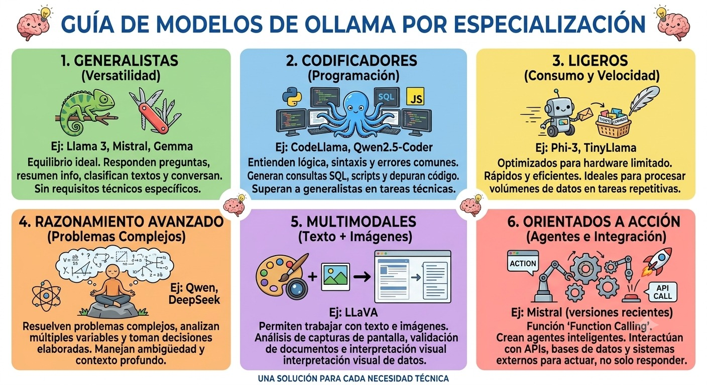
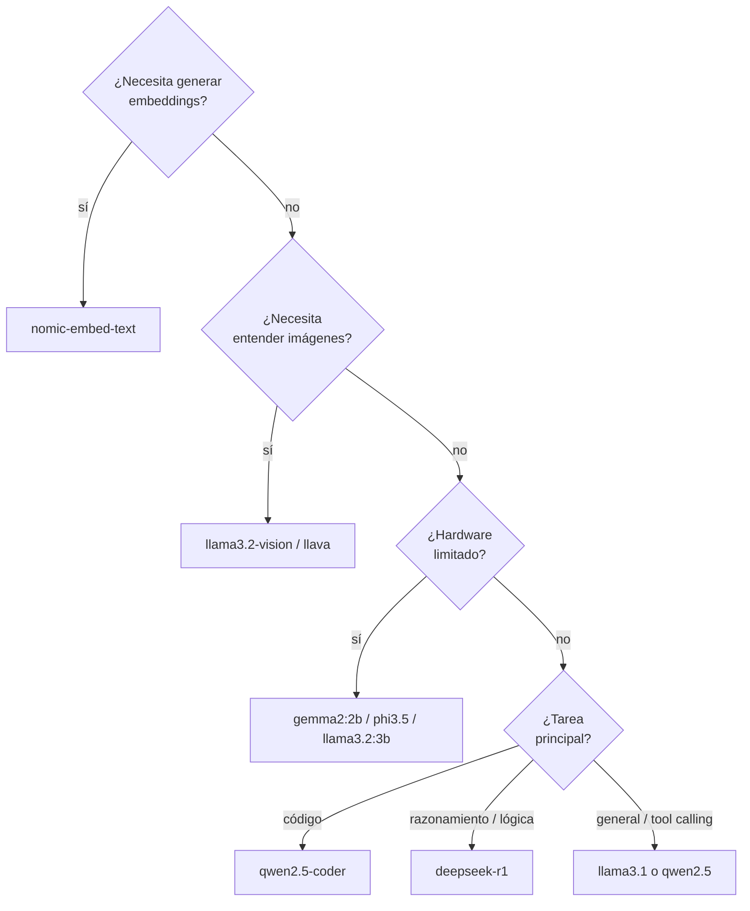

# Ollama: modelos y guía rápida de inicio

<figure markdown>

<figcaption>Modelos de Ollama agrupados por especialización: generalistas, codificadores, ligeros, razonamiento avanzado, multimodales y orientados a acción (function calling).</figcaption>
</figure>

!!! abstract "Tema central"
    Ollama es la herramienta que corre detrás de cada agente del curso — pero "correr un modelo local" no es una decisión única: hay decenas de modelos distintos, cada uno con su propia especialidad. Este módulo es una referencia rápida de qué modelo elegir y cómo arrancar con Ollama desde cero, sin vueltas.

## Objetivos de aprendizaje

- [ ] Instalar Ollama y ejecutar un modelo local desde la terminal en menos de 5 minutos.
- [ ] Nombrar al menos 4 modelos del catálogo de Ollama y su especialidad.
- [ ] Elegir con criterio qué modelo conviene para una tarea puntual del proyecto sincrónico.

## Guía rápida de inicio

=== "Linux / macOS"

    ```bash
    curl -fsSL https://ollama.com/install.sh | sh
    ollama pull llama3.1:8b
    ollama run llama3.1:8b
    ```

=== "Windows"

    ```powershell
    # Descargar el instalador desde https://ollama.com/download/windows
    ollama pull llama3.1:8b
    ollama run llama3.1:8b
    ```

Una vez instalado, estos son los comandos que vas a usar todo el curso:

```bash
ollama pull llama3.1:8b     # descarga un modelo
ollama run llama3.1:8b      # charla con el modelo en la terminal (Ctrl+D o /bye para salir)
ollama list                 # modelos ya descargados en tu máquina
ollama ps                   # modelos corriendo en memoria ahora mismo
ollama rm llama3.1:8b       # borra un modelo que ya no usás
```

Ollama también expone una API REST local (usada por defecto en `http://localhost:11434`) y un SDK de Python — ambos ya se usan en los ejemplos de código del curso:

```bash
curl http://localhost:11434/api/generate -d '{
  "model": "llama3.1:8b",
  "prompt": "Decime hola en una palabra",
  "stream": false
}'
```

```python
import ollama

respuesta = ollama.chat(model="llama3.1:8b", messages=[{"role": "user", "content": "Hola"}])
print(respuesta["message"]["content"])
```

!!! tip "Nodo dice"
    No hace falta bajar los 10 modelos del catálogo para arrancar. Con `llama3.1:8b` (generalista) y `nomic-embed-text` (para la memoria del [Módulo 3](../modulos/03-memoria-y-estado.md)) ya tenés todo lo que pide el curso hasta la Semana 9.

## Catálogo de modelos y su especialidad

| Modelo | Organización | Tamaños típicos | Especialidad | Cuándo usarlo |
|---|---|---|---|---|
| `llama3.1` | Meta | 8B, 70B, 405B | Generalista, buen soporte de tool calling | El modelo por defecto del curso — punto de partida razonable para casi cualquier agente |
| `llama3.2` | Meta | 1B, 3B (texto) · 11B, 90B (visión) | Versiones livianas para hardware modesto, y variantes con visión | Hardware limitado, o cuando el agente necesita "ver" una imagen |
| `qwen2.5` | Alibaba | 0.5B a 72B | Fuerte en multilingüe y en seguir instrucciones estructuradas (JSON) | Buena alternativa a Llama, especialmente para tool calling |
| `qwen2.5-coder` | Alibaba | 0.5B a 32B | Especializado en generar y explicar código | Agentes que escriben o revisan código |
| `mistral` / `mistral-nemo` | Mistral AI | 7B, 12B | Eficiente, buen balance entre calidad y velocidad | Priorizar latencia sin sacrificar demasiada calidad |
| `gemma2` | Google | 2B, 9B, 27B | Liviano y eficiente en recursos | Laptops sin GPU dedicada |
| `phi3` / `phi3.5` | Microsoft | 3.8B, 14B | Muy capaz para su tamaño, buen razonamiento | Hardware realmente limitado, pero necesitás razonamiento decente |
| `deepseek-r1` | DeepSeek | 1.5B a 70B (versiones destiladas) | Razonamiento explícito paso a paso, nativo | Tareas de lógica o matemática, o donde el "por qué" de la respuesta importa |
| `llama3.2-vision` / `llava` | Meta / comunidad | variable | Multimodal: entienden imágenes además de texto | Agentes que reciben capturas de pantalla, fotos o diagramas |
| `nomic-embed-text` | Nomic AI | — | Genera embeddings, no conversa | La memoria del proyecto ([Módulo 3](../modulos/03-memoria-y-estado.md) y [Embeddings](embeddings.md)), no el agente que redacta |

## Cómo elegir un modelo



## Ejercicio práctico

Descargá dos modelos de tamaño muy distinto (ej. `llama3.2:1b` y `llama3.1:8b`) y hacéles la misma pregunta que requiera algo de razonamiento (ej. "¿Cuántas 'r' tiene la palabra 'arquitectura'?"). Compará velocidad y calidad de respuesta.

??? success "Ver solución"
    El modelo chico (1B) responde casi al instante pero es más propenso a equivocarse en tareas que requieren más razonamiento — incluyendo decidir *cuándo* usar una herramienta correctamente. El modelo grande (8B) tarda más pero suele acertar más seguido. La conclusión práctica: para el agente Investigador del proyecto (necesita buen criterio) conviene el modelo grande; para una subtarea simple y de alto volumen (ej. "¿esta pregunta necesita búsqueda, sí o no?") el modelo chico puede alcanzar de sobra — el mismo patrón de "enrutar a un modelo chico cuando alcanza" del módulo de [Optimización de tokens](optimizacion-tokens.md).

## Autoevaluación

<div class="mc-quiz" markdown>
¿Qué modelo del catálogo conviene si el agente necesita "ver" una captura de pantalla?

- [ ] `qwen2.5-coder`.
- [x] `llama3.2-vision` o `llava`.
- [ ] `nomic-embed-text`.
</div>

<div class="mc-quiz" markdown>
¿Qué hace el comando `ollama ps`?

- [ ] Instala un modelo nuevo desde el catálogo.
- [x] Muestra qué modelos están corriendo en memoria en este momento.
- [ ] Borra todos los modelos descargados.
</div>

<div class="mc-quiz" markdown>
¿Por qué `nomic-embed-text` no sirve para mantener una conversación con el agente?

- [ ] Porque es demasiado lento para usarse en un agente.
- [x] Porque genera embeddings (vectores), no texto conversacional.
- [ ] Porque no está disponible para correr en Ollama.
</div>

## Videos recomendados

<div class="video-embed" data-yt-id="FWLhkIsETbA" data-title="Instala y Configura Ollama desde Cero para Crear tu IA Local"></div>

**[Instala y Configura Ollama desde Cero para Crear tu IA Local](https://www.youtube.com/watch?v=FWLhkIsETbA)** — (en español). Guía paso a paso de instalación y primeros pasos, en línea con la guía rápida de este módulo.

Más videos sobre este módulo:

| Video | Canal | Por qué verlo |
|---|---|---|
| [Cómo Correr Modelos de IA Localmente \| Ollama Tutorial en Español](https://www.youtube.com/watch?v=gKVCnU5KCc0) | — (en español) | Cubre cómo correr distintos modelos locales sin depender de la nube. |
| [Curso de OLLAMA 2026: Tu propia Inteligencia Artificial en LOCAL](https://www.youtube.com/watch?v=FFjvZV05vxM) | — (en español) | Recorrido más extenso de instalación, uso y casos reales con Ollama. |

## Checklist de cierre

- [ ] Instalé Ollama y descargué al menos dos modelos de tamaño distinto.
- [ ] Puedo explicar la especialidad de al menos 4 modelos del catálogo.
- [ ] Usé `ollama ps` y `ollama list` para inspeccionar mi instalación local.
- [ ] Elegí, con criterio (no al azar), qué modelo conviene para cada agente del proyecto sincrónico.
