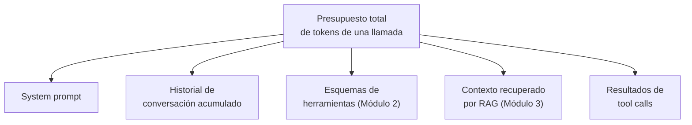
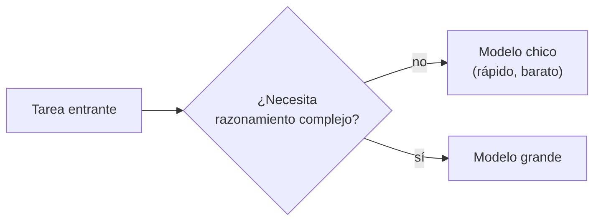

# Consumo y optimización de tokens

!!! abstract "Tema central"
    Cada llamada a un LLM tiene un costo en tokens — de espacio en el contexto, de latencia, y (si en algún momento se usa un proveedor pago) de dinero. Este módulo complementa al [Módulo 11 — Producción](../modulos/11-produccion.md) con el detalle de qué consume tokens más rápido de lo esperado y cómo reducirlo sin perder calidad.

## Objetivos de aprendizaje

- [ ] Explicar por qué el español puede consumir más tokens que el inglés para el mismo contenido.
- [ ] Identificar, en un agente real, las 4-5 fuentes principales de consumo de tokens.
- [ ] Aplicar al menos dos estrategias concretas de reducción sin romper el comportamiento del agente.

## Cómo se cuentan los tokens

Un token no es una palabra — es una unidad de subtexto que depende del *tokenizador* de cada modelo. En inglés, una aproximación común es ~4 caracteres por token. En español, por los acentos, la mayor longitud promedio de palabras y ciertas conjugaciones, el mismo contenido suele necesitar **más tokens** que su equivalente en inglés.

```python
# Con tiktoken (aproximación práctica, aunque los modelos de Ollama
# usan su propio tokenizador, la intuición es la misma)
import tiktoken

enc = tiktoken.get_encoding("cl100k_base")
print(len(enc.encode("Investigá el estado del mercado de vehículos eléctricos")))
print(len(enc.encode("Research the state of the electric vehicle market")))
```

!!! tip "Con Ollama, el conteo real está en la respuesta"
    Cada respuesta de Ollama incluye `prompt_eval_count` (tokens del prompt de entrada) y `eval_count` (tokens generados) — no hace falta estimarlo, se puede medir directo y loguearlo como parte de la instrumentación del [Módulo 11](../modulos/11-produccion.md).

## Qué consume tokens más rápido de lo esperado



En un agente con varias herramientas y varios turnos de conversación, es común que el **historial acumulado** y los **esquemas de herramientas repetidos en cada llamada** pesen más que el mensaje del usuario — y es la parte que menos se nota crecer hasta que el costo o la latencia se vuelven un problema.

## Estrategias de optimización

### 1. Resumir en vez de acumular

En vez de mandar el historial completo en cada turno, resumir los turnos viejos y mantener solo los últimos literales:

```python
def construir_contexto(historial: list, ventana: int = 4) -> list:
    recientes = historial[-ventana:]
    si_hay_mas = historial[:-ventana]
    if not si_hay_mas:
        return recientes
    resumen = resumir(si_hay_mas)  # una llamada más chica, corrida aparte
    return [{"role": "system", "content": f"Resumen de la conversación previa: {resumen}"}] + recientes
```

### 2. Filtrar resultados de herramientas antes de devolverlos

Una búsqueda web puede devolver miles de caracteres — el agente casi nunca necesita el HTML/JSON crudo completo:

```python
def buscar_web(query: str) -> str:
    resultados = ddgs_search(query, max_results=3)
    # Devolver solo título + resumen corto, no la página completa
    return "\n".join(f"- {r['title']}: {r['body'][:200]}" for r in resultados)
```

### 3. RAG: recuperar menos, pero más relevante

Subir `n_results` en una consulta a un vector store no mejora la respuesta si el contenido extra es irrelevante — empeora el "contexto contaminado" del [Módulo 3](../modulos/03-memoria-y-estado.md) y consume tokens sin necesidad. Mejor invertir en mejorar qué se recupera (chunking más fino, *reranking*) que en recuperar más.

### 4. Esquemas de herramientas concisos

Del [Módulo 2](../modulos/02-herramientas.md): la descripción de cada herramienta viaja en *cada* llamada. Descripciones claras pero cortas ahorran tokens en cada turno, no solo una vez.

### 5. Enrutar a un modelo más chico cuando alcanza

No todas las subtareas necesitan el modelo más grande disponible. Un paso de clasificación simple (¿esta pregunta necesita búsqueda o no?) puede resolverse con un modelo más chico y rápido, reservando el modelo grande para el razonamiento que de verdad lo requiere.



### 6. Prompt caching (si en algún momento se usa un proveedor de pago)

Varios proveedores de API cachean la parte fija de un prompt (el system prompt largo, por ejemplo) para no volver a cobrarla completa en cada llamada si no cambió. No aplica igual a un modelo local con Ollama (no hay costo por token), pero vale saberlo si el curso en algún momento compara contra un proveedor propietario como demostración puntual (ver [Stack técnico](../recursos/stack-tecnico.md)).

## Checklist de optimización, en orden de impacto típico

- [ ] ¿El historial se resume en vez de acumularse sin límite?
- [ ] ¿Los resultados de herramientas se filtran antes de volver al modelo?
- [ ] ¿El RAG recupera lo justo y necesario, no "por las dudas"?
- [ ] ¿Las descripciones de herramientas son claras pero no verborrágicas?
- [ ] ¿Hay subtareas que podrían resolverse con un modelo más chico?

## Videos recomendados

<div class="video-embed" data-yt-id="nKSk_TiR8YA" data-title="Most devs don't understand how LLM tokens work"></div>

**[Most devs don't understand how LLM tokens work](https://www.youtube.com/watch?v=nKSk_TiR8YA)** — Matt Pocock. Explica cómo se cuentan los tokens y por qué importa para el costo y la latencia, enfocado en developers. Tiene doblaje automático disponible en español.

Más videos sobre este tema:

| Video | Canal | Por qué verlo |
|---|---|---|
| [Let's build the GPT Tokenizer](https://www.youtube.com/watch?v=zduSFxRajkE) | Andrej Karpathy | Profundidad real sobre cómo funciona la tokenización (BPE) — la base técnica de por qué el español consume más tokens que el inglés. |
| [Así reduje en un 85% el consumo de tokens en Claude Code](https://www.youtube.com/watch?v=XKazxtzdyO8) | Carlos Alarcón - AI (en español) | Estrategias prácticas y actuales de gestión de contexto y caching para reducir consumo de tokens en agentes. |
| [How and When to Use Anthropic's Prompt Caching Feature](https://www.youtube.com/watch?v=_0uiiJfsBPI) | Mark Kashef | Cubre prompt caching con ejemplos de código — técnica clave para reducir costo en contexto largo. |

## Checklist de cierre

- [ ] Medí (con `prompt_eval_count`/`eval_count` de Ollama) cuántos tokens consume una llamada real del proyecto sincrónico.
- [ ] Identifiqué cuál de las 5 fuentes de consumo pesa más en el agente del proyecto.
- [ ] Apliqué al menos una estrategia de optimización y medí la diferencia.
