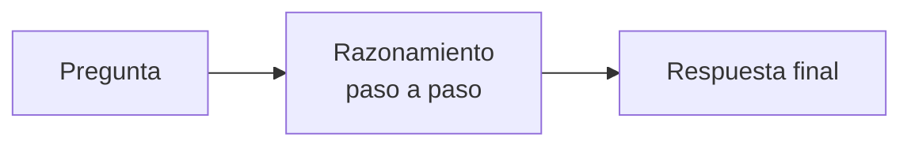

# Prompt engineering avanzado

!!! abstract "Tema central"
    El [Módulo 1](../modulos/01-fundamentos.md) cubre el system prompt básico de rol. Acá van técnicas más específicas para exprimir mejor un LLM sin cambiar de modelo ni de framework: few-shot, chain-of-thought, structured output y patrones de diseño de system prompts.

## Objetivos de aprendizaje

- [ ] Aplicar few-shot prompting para mejorar la consistencia de un formato de salida.
- [ ] Usar chain-of-thought cuando la tarea lo justifica, sabiendo su costo en tokens.
- [ ] Forzar una salida estructurada (JSON) de forma confiable.
- [ ] Aplicar una plantilla de diseño de system prompt reutilizable.

## Few-shot prompting

Mostrarle al modelo 2-3 ejemplos de entrada/salida deseada, dentro del propio prompt, en vez de solo describir la tarea en abstracto:

```python
prompt = """
Clasificá el sentimiento de cada reseña como Positivo, Negativo o Neutral.

Reseña: "Llegó roto y nadie respondió mi reclamo."
Sentimiento: Negativo

Reseña: "Cumple lo que promete, sin sorpresas."
Sentimiento: Neutral

Reseña: "Superó mis expectativas, lo recomiendo."
Sentimiento: Positivo

Reseña: "{reseña_nueva}"
Sentimiento:
"""
```

!!! tip "Cuándo vale la pena"
    Few-shot ayuda más cuando el formato de salida es específico o ambiguo con solo una descripción (ej. una categorización con límites difusos). Si la tarea ya es clara con una instrucción directa, agregar ejemplos solo consume tokens de más sin mejorar el resultado — probar sin ejemplos primero.

## Chain-of-thought (CoT)

Pedirle al modelo que razone paso a paso *antes* de dar la respuesta final mejora la precisión en tareas que requieren varios pasos lógicos (cálculos, decisiones con múltiples condiciones):

```python
prompt = """
Pregunta: Un equipo tiene 3 agentes. Cada uno cuesta 2 llamadas por
tarea. Si el equipo procesa 15 tareas, ¿cuántas llamadas totales se
hacen?

Pensá paso a paso antes de dar la respuesta final.
"""
```



!!! warning "CoT no es gratis"
    Cada paso de razonamiento son tokens generados de más — más latencia y más costo (ver [Consumo y optimización de tokens](optimizacion-tokens.md)). Reservarlo para tareas donde el error de "responder directo" es costoso; para clasificaciones simples suele sobrar.

## Structured output (JSON confiable)

Pedir "respondé en JSON" en texto libre no garantiza que el modelo lo cumpla siempre. Es más confiable combinar una instrucción explícita del esquema con validación posterior en código (y, cuando el proveedor lo soporta, un modo de *structured output* forzado a nivel de API, no solo de prompt):

```python
import json

prompt = """
Respondé ÚNICAMENTE con un JSON con esta forma exacta, sin texto
adicional antes o después:
{"categoria": "<string>", "confianza": <número entre 0 y 1>}
"""

respuesta_texto = modelo.invoke(prompt)

try:
    resultado = json.loads(respuesta_texto)
except json.JSONDecodeError:
    # el modelo no respetó el formato — reintentar o loguear el caso
    resultado = None
```

Esto es el mismo principio que el tool calling del [Módulo 2](../modulos/02-herramientas.md) (salida estructurada en vez de texto libre), aplicado sin necesariamente pasar por una tool call formal.

## Patrones de diseño de system prompts

Una plantilla reutilizable para armar system prompts de agentes, en el orden que suele funcionar mejor:

```markdown
1. Rol: quién es el agente y en qué contexto opera.
2. Objetivo: qué tiene que lograr, en una frase.
3. Herramientas disponibles: qué puede hacer y cuándo debe usarlas.
4. Restricciones: qué NO debe hacer (del Módulo 6: "qué NO debe hacer cada agente").
5. Formato de salida esperado.
6. Ejemplos (si aplica few-shot).
```

```python
system_prompt = """
Sos el agente Investigador del sistema de reportes.
Objetivo: encontrar información confiable sobre el tema que te den.
Herramientas: tenés acceso a buscar_web. Usala solo si la pregunta
requiere datos que puedan haber cambiado recientemente.
Restricciones: no redactes el informe final, solo entregá hallazgos
con sus fuentes. Nunca afirmes haber buscado algo que no buscaste.
Formato: lista de hallazgos, cada uno con su fuente.
"""
```

## Videos recomendados

<div class="video-embed" data-yt-id="ysPbXH0LpIE" data-title="Prompting 101 | Code w/ Claude"></div>

**[Prompting 101 | Code w/ Claude](https://www.youtube.com/watch?v=ysPbXH0LpIE)** — Anthropic (oficial). Patrones de diseño de system prompts y técnicas avanzadas directamente de quienes construyen los modelos. Tiene doblaje automático disponible en español.

Más videos sobre este tema:

| Video | Canal | Por qué verlo |
|---|---|---|
| [Prompt Engineering Guide - From Beginner to Advanced](https://www.youtube.com/watch?v=uDIW34h8cmM) | Matthew Berman | Recorrido extenso de técnicas básicas a avanzadas, con few-shot y chain-of-thought aplicados. |
| [Master AI Prompting: Zero-Shot, Few-Shot & Chain of Thought Explained](https://www.youtube.com/watch?v=sZIV7em3JA8) | — | Enfocado puntualmente en la comparación zero-shot / few-shot / chain-of-thought. |

## Checklist de cierre

- [ ] Reescribí un prompt del proyecto sincrónico agregando 2-3 ejemplos few-shot y comparé el resultado contra la versión sin ejemplos.
- [ ] Identifiqué un paso del proyecto donde chain-of-thought mejora la respuesta, y uno donde solo agrega costo sin beneficio.
- [ ] El agente Redactor del proyecto devuelve JSON válido de forma confiable (con manejo del caso en que no lo hace).
