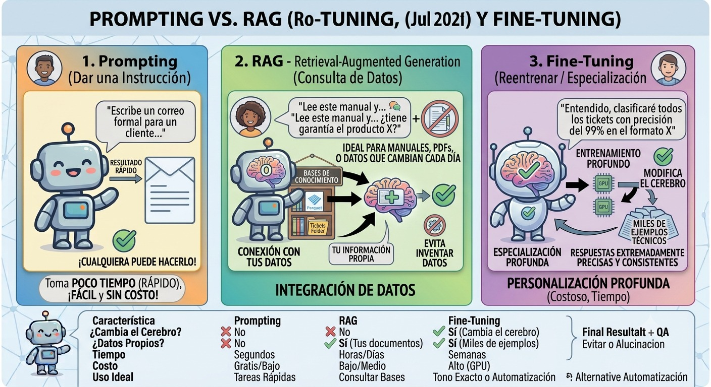
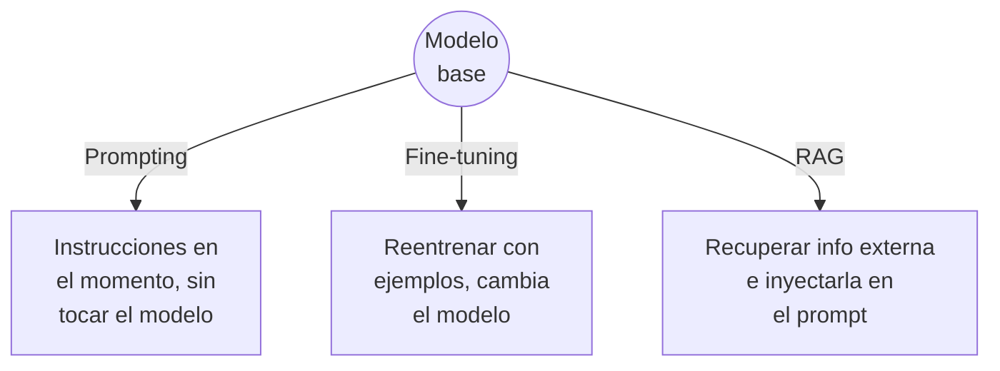
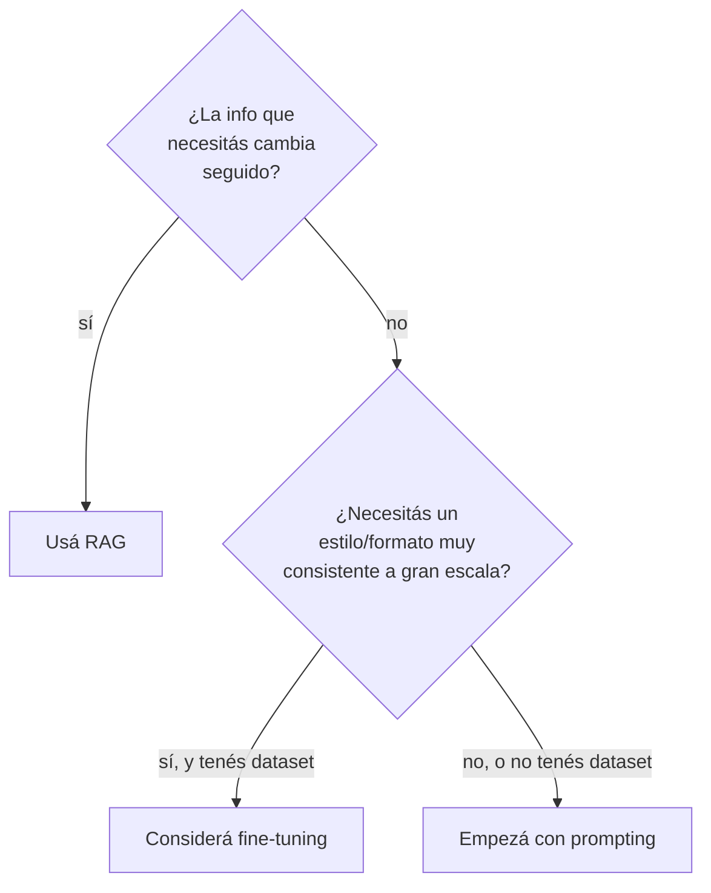

# Prompting vs. fine-tuning vs. RAG, en profundidad

<figure markdown>

<figcaption>Prompting, RAG y Fine-Tuning comparados: qué modifican, tiempo, costo y uso ideal de cada técnica.</figcaption>
</figure>

!!! abstract "Tema central"
    Tres técnicas distintas para lograr que un LLM se comporte como necesitás en una tarea específica — cada una con trade-offs distintos de costo, velocidad de iteración y control. El [Módulo 0](../modulos/00-introduccion-general.md) las presenta en una línea cada una; acá se profundiza cada técnica por separado, con ejemplos concretos de cuándo elegir cuál.

## Objetivos de aprendizaje

- [ ] Explicar prompting, fine-tuning y RAG con sus propias palabras, sin confundir uno con otro.
- [ ] Dado un caso de uso, justificar qué técnica (o combinación) conviene y por qué.
- [ ] Nombrar al menos una limitación real de cada técnica.

## Las tres, en un vistazo



## Prompting

**Qué es:** dirigir el comportamiento del modelo únicamente con las instrucciones que le das en cada llamada (system prompt, ejemplos en el propio prompt, formato pedido). El modelo no cambia — solo cambia lo que le pedís.

**Ejemplo:**

```python
system_prompt = """
Sos un clasificador de tickets de soporte. Para cada ticket, respondé
SOLO con una de estas categorías: Facturación, Bug, Pregunta general.
No expliques tu razonamiento, solo la categoría.
"""
```

**Cuándo usarlo:**

- El comportamiento que necesitás se puede describir en instrucciones claras.
- Necesitás iterar rápido (cambiar el prompt no cuesta nada, cambiar un modelo fine-tuneado sí).
- No tenés un dataset grande y curado de ejemplos.

**Límite real:** si la tarea requiere conocimiento que el modelo no tiene (datos privados, información posterior a su entrenamiento) o un estilo muy específico y consistente en miles de casos, prompting solo no alcanza — ahí entran RAG o fine-tuning.

## Fine-tuning

**Qué es:** continuar entrenando el modelo con un dataset de ejemplos propio, para que el comportamiento deseado quede "grabado" en sus parámetros, sin depender de instrucciones repetidas en cada prompt. En la práctica casi nadie reentrena todos los parámetros (*full fine-tuning*, carísimo) — se usan técnicas de *fine-tuning eficiente* como **LoRA** o **QLoRA**, que ajustan solo una fracción pequeña de parámetros nuevos.

**Ejemplo conceptual** (con Hugging Face + LoRA, no se corre en el curso pero vale para entender la forma):

```python
from peft import LoraConfig, get_peft_model

config = LoraConfig(
    r=8,                    # rango de la adaptación (más alto = más capacidad, más costo)
    lora_alpha=16,
    target_modules=["q_proj", "v_proj"],
    lora_dropout=0.05,
)
modelo_ajustado = get_peft_model(modelo_base, config)
# Luego se entrena modelo_ajustado con el dataset propio (pares input/output)
```

**Cuándo usarlo:**

- Necesitás un estilo o formato de salida extremadamente consistente en un volumen alto de casos.
- La tarea se puede reducir a "dado este input, quiero siempre este tipo de output", con cientos o miles de ejemplos disponibles.
- El costo de tener el prompt gigante en cada llamada (por instrucciones muy largas) supera el costo de entrenar una vez.

**Límite real:** requiere GPU (aunque sea alquilada), un dataset de calidad, tiempo de entrenamiento, y versionar/desplegar el modelo resultante. No sirve para "que el modelo sepa algo nuevo que cambia seguido" — para eso es mejor RAG, porque actualizar un fine-tune por cada cambio de información es carísimo e inviable a corto plazo.

!!! tip "Nodo dice"
    LoRA/QLoRA existen porque reentrenar TODOS los parámetros de un modelo grande es prohibitivo incluso para empresas grandes. La idea es congelar el modelo original y entrenar solo un puñado de parámetros nuevos "al costado" — mucho más barato, y en la práctica anda sorprendentemente bien para la mayoría de los casos.

## RAG (Retrieval-Augmented Generation)

**Qué es:** en el momento de responder, buscar información relevante en una fuente externa (un vector store, una base de datos, documentos) e inyectarla en el prompt antes de generar la respuesta. El modelo no cambia — se le da contexto adicional recién antes de responder. Es la técnica que se usa desde el [Módulo 3](../modulos/03-memoria-y-estado.md) del curso.

**Ejemplo:**

```python
consulta = "¿Cuál es la política de reembolsos?"
contexto_recuperado = vector_store.query(consulta, n_results=3)

prompt = f"""
Contexto relevante:
{contexto_recuperado}

Pregunta: {consulta}
Respondé usando solo la información del contexto. Si no está, decilo.
"""
```

**Cuándo usarlo:**

- La información cambia seguido (precios, políticas, documentación) — no tiene sentido reentrenar por cada actualización.
- Necesitás que el modelo cite fuentes o admita cuando no sabe algo.
- Es información privada/propia que nunca estuvo en el entrenamiento del modelo.

**Límite real:** la calidad de la respuesta depende directamente de la calidad de lo recuperado — un mal *retrieval* (información irrelevante o incompleta) produce una mala respuesta aunque el modelo sea excelente. Ver "contexto contaminado" en el [Módulo 3](../modulos/03-memoria-y-estado.md).

## Tabla comparativa

| Criterio | Prompting | Fine-tuning | RAG |
|---|---|---|---|
| Costo inicial | Ninguno | Alto (cómputo + dataset) | Medio (infra de retrieval) |
| Velocidad de iteración | Inmediata | Lenta (hay que reentrenar) | Rápida (actualizar la fuente) |
| Requiere GPU de entrenamiento | No | Sí | No |
| Bueno para conocimiento que cambia | No | No | Sí |
| Bueno para estilo/formato muy consistente | Limitado | Sí | No directamente |
| Puede citar fuentes | No | No | Sí |
| Usado en este curso | Desde el Módulo 1 | No (fuera de alcance, sin costo) | Desde el Módulo 3 |

## Árbol de decisión



## Casos de uso concretos

| Escenario | Técnica recomendada | Por qué |
|---|---|---|
| Chatbot que responde sobre la documentación de tu producto, que se actualiza cada semana | **RAG** | La info cambia seguido; reentrenar cada semana no es viable. |
| Clasificador que debe responder siempre en un JSON exacto con 3 campos fijos, sobre miles de tickets por día | **Prompting** primero (structured output), **fine-tuning** solo si el volumen justifica el costo y prompting no logra consistencia suficiente | Empezar simple; escalar a fine-tuning solo si hace falta. |
| Asistente legal que debe responder en el tono y formato exacto de los dictámenes de un estudio específico, con cientos de ejemplos históricos disponibles | **Fine-tuning** (o prompting con few-shot extenso como paso intermedio) | Estilo muy específico y consistente, con dataset disponible. |
| Agente de investigación del proyecto sincrónico de este curso | **Prompting + RAG** | Instrucciones de rol (prompting) + memoria de investigaciones previas (RAG, Módulo 3) — no hace falta fine-tuning para este caso. |

!!! tip "No son mutuamente excluyentes"
    En sistemas reales es común combinar las tres: un system prompt bien diseñado (prompting), que además recibe contexto recuperado (RAG), corriendo sobre un modelo eventualmente ajustado (fine-tuning) para un estilo particular. El proyecto sincrónico del curso combina prompting y RAG — fine-tuning queda fuera de alcance porque requiere cómputo que rompe la política de costo cero del curso.

## Videos recomendados

<div class="video-embed" data-yt-id="bjCdsnkQ6Dw" data-title="ChatGPT Prompting vs RAG vs fine tuning: Aprovecha la IA al máximo"></div>

**[ChatGPT Prompting vs RAG vs fine tuning: Aprovecha la IA al máximo](https://www.youtube.com/watch?v=bjCdsnkQ6Dw)** — CodelyTV (en español). Usa 3 ejemplos concretos para diferenciar qué se logra con cada técnica, en formato directo para audiencia técnica.

Más videos sobre este tema:

| Video | Canal | Por qué verlo |
|---|---|---|
| [RAG vs Fine Tuning vs Prompt Engineering: Use Cases And Key Differences Explained](https://www.youtube.com/watch?v=2m1rWVy4uqE) | Simplilearn | Cubre casos de uso concretos de cada enfoque con buen nivel de detalle. |
| [Fine-tuning vs RAG vs Prompting: Cuál Usar Realmente en IA](https://www.youtube.com/watch?v=lU4Yk6BG9IQ) | Christian Donaire · Nodd3r (en español) | Contenido reciente centrado en cuándo usar cada técnica — canal más chico, verificar antes de citarlo como fuente principal. |

## Checklist de cierre

- [ ] Puedo explicar las tres técnicas sin mirar la tabla.
- [ ] Elegí correctamente la técnica para cada uno de los 4 casos de uso de la tabla, antes de ver la respuesta.
- [ ] Entiendo por qué el proyecto sincrónico del curso usa prompting + RAG y no fine-tuning.
