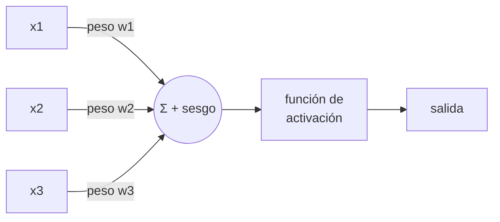
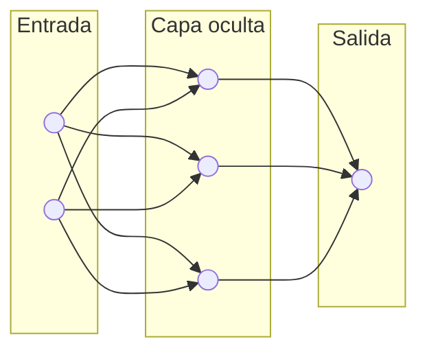
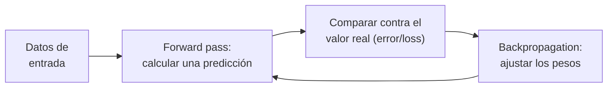

# Redes neuronales

!!! abstract "Tema central"
    Un LLM es, en el fondo, una red neuronal gigante. Este módulo explica qué es una red neuronal desde cero — neuronas, capas, cómo aprenden — y cierra con una **simulación interactiva en tiempo real** para ver el proceso de entrenamiento con tus propios ojos, no solo leerlo. Es la base conceptual del módulo de [Arquitectura de Transformers](arquitectura-transformers.md).

## Objetivos de aprendizaje

- [ ] Explicar qué hace una neurona artificial (entradas, pesos, sesgo, activación).
- [ ] Explicar por qué apilar neuronas en capas permite aprender patrones complejos.
- [ ] Describir, a alto nivel, el ciclo de entrenamiento (forward pass → error → backpropagation).
- [ ] Usar la simulación en vivo para observar cómo cambia la frontera de decisión mientras la red entrena.

## Qué es una neurona artificial

Una neurona artificial toma varias entradas, las combina con un peso propio para cada una, suma un sesgo (*bias*), y pasa el resultado por una función de activación que decide "cuánto se enciende":

- **Pesos (weights)**: qué tan importante es cada entrada para esta neurona — son los números que la red ajusta al entrenar.
- **Sesgo (bias)**: un valor extra que le permite a la neurona activarse (o no) incluso con entradas en cero.
- **Activación**: una función no lineal (ReLU, tanh, sigmoid) que le da a la red la capacidad de aprender patrones que no son simplemente una línea recta.

## De neuronas a red: capas

Una sola neurona puede muy poco. El poder aparece al apilarlas en **capas**, donde la salida de una capa es la entrada de la siguiente:

Cada capa "oculta" (entre la entrada y la salida) aprende a reconocer patrones cada vez más abstractos — en una red que clasifica imágenes, las primeras capas detectan bordes simples, y las capas siguientes combinan esos bordes en formas más complejas.

## Cómo aprende: el ciclo de entrenamiento

La red no "sabe" nada al principio — sus pesos empiezan en valores aleatorios. En cada vuelta del ciclo: hace una predicción (*forward pass*), mide qué tan lejos estuvo de la respuesta correcta (*loss*), y ajusta cada peso un poquito en la dirección que reduce ese error (*backpropagation* + *gradient descent*). Repetido miles de veces, sobre miles de ejemplos, los pesos convergen a valores que "funcionan".

!!! tip "Nodo dice"
    No hace falta entender el cálculo detrás de backpropagation para usar LLMs — igual que no hace falta saber mecánica de motores para manejar un auto. Pero tener la intuición de "ajusta pesos de a poquito, muchas veces" te va a servir cuando leas sobre fine-tuning en el módulo [Prompting vs. fine-tuning vs. RAG](prompting-vs-finetuning-vs-rag.md).

## Simulación en tiempo real

Esta es la [TensorFlow Playground](https://playground.tensorflow.org/), una herramienta pública de Google que entrena una red neuronal real, en vivo, en tu navegador — sin instalar nada. Le dimos una configuración de ejemplo (clasificar los puntos azules y naranjas de un círculo) para que arranques directo:

<iframe src="https://playground.tensorflow.org/#activation=tanh&amp;batchSize=10&amp;dataset=circle&amp;regDataset=reg-plane&amp;learningRate=0.03&amp;regularizationRate=0&amp;noise=0&amp;networkShape=4,2&amp;seed=0.78279&amp;showTestData=false&amp;discretize=false&amp;percTrainData=50&amp;x=true&amp;y=true&amp;xTimesY=false&amp;xSquared=false&amp;ySquared=false&amp;cosX=false&amp;sinX=false&amp;cosY=false&amp;sinY=false&amp;collectStats=false&amp;problem=classification&amp;initZero=false&amp;hideText=false" title="TensorFlow Playground — simulación de red neuronal en tiempo real" loading="lazy"></iframe>

[:octicons-link-external-24: Abrir en una pestaña aparte](https://playground.tensorflow.org/#activation=tanh&batchSize=10&dataset=circle&regDataset=reg-plane&learningRate=0.03&regularizationRate=0&noise=0&networkShape=4,2&seed=0.78279&showTestData=false&discretize=false&percTrainData=50&x=true&y=true&xTimesY=false&xSquared=false&ySquared=false&cosX=false&sinX=false&cosY=false&sinY=false&collectStats=false&problem=classification&initZero=false&hideText=false){ target="_blank" }

**Qué mirar:**

- Apretá el botón de **▶ play** (arriba a la izquierda) para empezar a entrenar.
- El fondo de la grilla de la derecha es la **frontera de decisión** — mirá cómo pasa de ser aleatoria a separar los puntos azules de los naranjas, en vivo.
- Las **líneas entre neuronas** son los pesos: el grosor y el color (azul o naranja) representan su magnitud y signo, y cambian mientras la red aprende.
- El número de **Training loss**, arriba a la derecha, debería ir bajando — es el error que backpropagation intenta minimizar.
- Probá cambiar la forma de la red (`networkShape`, los números de capas ocultas) desde los controles y volvé a entrenar — con menos neuronas, a veces la red no logra separar bien el círculo.

## Ejercicio práctico

En la simulación, cambiá el dataset (arriba a la izquierda) de "circle" a "spiral" (espiral) y dejala entrenar. ¿La red con la arquitectura actual (2 capas ocultas, 4 y 2 neuronas) logra separar la espiral tan bien como separaba el círculo?

??? success "Ver solución"
    Con la arquitectura por defecto, la espiral es mucho más difícil de separar que el círculo — vas a ver que el loss se queda estancado en un valor alto y la frontera de decisión no logra "enroscarse" siguiendo la espiral. Para resolverla mejor hace falta una red más grande (más neuronas y/o más capas) y a veces más features de entrada (activar `sinX`, `sinY` en los controles). Esto ilustra un punto central: la capacidad de una red para aprender un patrón depende de su arquitectura, no solo de cuánto tiempo la dejes entrenar.

## Autoevaluación

¿Qué hace backpropagation en el ciclo de entrenamiento?

- [ ] Genera nuevos datos de entrada para la red.
- [x] Ajusta los pesos de la red en la dirección que reduce el error medido.
- [ ] Decide cuántas capas va a tener la red.

¿Qué representan los pesos (weights) de una neurona?

- [ ] Cuántas capas tiene la red en total.
- [x] Qué tan importante es cada entrada para esa neurona en particular.
- [ ] El número de ejemplos usados para entrenar.

En la simulación del Playground, ¿qué representan el grosor y el color de las líneas entre neuronas?

- [ ] La velocidad de la conexión a internet.
- [x] La magnitud y el signo de los pesos de la red.
- [ ] El nombre de cada capa.

## Videos recomendados

**[But what is a Neural Network? | Deep learning, chapter 1](https://www.youtube.com/watch?v=aircAruvnKk)** — 3Blue1Brown. La explicación visual de referencia sobre neuronas, capas y pesos — el mismo canal y la misma serie del video recomendado en Arquitectura de Transformers.

Más videos sobre este módulo:

| Video | Canal | Por qué verlo |
|---|---|---|
| [¿Qué es una Red Neuronal? Parte 1: La Neurona](https://www.youtube.com/watch?v=MRIv2IwFTPg) | Dot CSV (en español) | Explica la neurona artificial y su relación con la regresión lineal, en español y con buen ritmo. |
| [¿Qué es una Red Neuronal? Parte 2: La Red](https://www.youtube.com/watch?v=uwbHOpp9xkc) | Dot CSV (en español) | Continúa la serie explicando cómo se conectan varias neuronas en una red completa. |

## Checklist de cierre

- [ ] Puedo explicar con mis palabras qué es un peso y qué es un sesgo.
- [ ] Dejé entrenar la simulación en vivo y vi la frontera de decisión estabilizarse.
- [ ] Probé el ejercicio con el dataset "spiral" y entendí por qué es más difícil que el círculo.
- [ ] Puedo conectar esto con el módulo de [Arquitectura de Transformers](arquitectura-transformers.md): un transformer es, entre otras cosas, muchas de estas redes apiladas.
