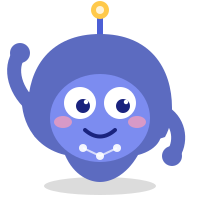
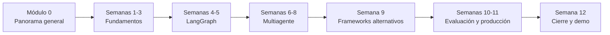

# Guía Multiagente

## Curso: Agentes y Sistemas Multiagente con LLMs

Creado y dictado por **Michel Abello**.

Sesiones diarias de 30 minutos · Audiencia: desarrolladores con experiencia · Duración: 12 semanas (continuo)

¡Hola, soy **Nodo**! Voy a acompañarte por los 12 módulos del curso — buscame en la esquina inferior derecha de cada página si en algún momento no sabés por dónde seguir. Si es tu primera vez acá, te recomiendo arrancar por el [Módulo 0](modulos/00-introduccion-general.md).

!!! success "100% open source y sin costo"
    Todo el stack del curso corre gratis: **Ollama** (modelos locales), **LangGraph**, **CrewAI**/**AutoGen**, **ChromaDB** y **Langfuse self-hosted**. No hace falta tarjeta de crédito ni API key de pago para completar el curso. Detalle completo en [Stack técnico](recursos/stack-tecnico.md).

Este sitio es la documentación completa del curso, organizada por módulo. Cada módulo incluye: tema central, desglose sesión por sesión, ejemplos de código, diagramas, videos recomendados y notas para quien dicta la clase.

## Cómo está armado el curso

Un mismo [proyecto sincrónico](proyecto-sincronico.md) —una agencia de investigación y reporte automatizado— crece semana a semana con cada concepto nuevo, así siempre hay algo demostrable al final de cada sesión.

## Módulos

-   :material-compass-outline:{ .lg .middle } **Panorama general** _(orientación)_

    ---

    Qué es un LLM, cómo se llega de LLM a agente, y mapa del ecosistema del curso.

    [:octicons-arrow-right-24: Empezar por acá](modulos/00-introduccion-general.md)

-   :material-numeric-1-circle:{ .lg .middle } **Fundamentos**

    ---

    Qué es un agente, el loop ReAct, prompting para acción.

    [:octicons-arrow-right-24: Semana 1](modulos/01-fundamentos.md)

-   :material-numeric-2-circle:{ .lg .middle } **Herramientas (Tool Calling)**

    ---

    Function/tool calling, esquemas JSON, manejo de errores.

    [:octicons-arrow-right-24: Semana 2](modulos/02-herramientas.md)

-   :material-numeric-3-circle:{ .lg .middle } **Memoria y estado**

    ---

    Contexto corto/largo plazo, RAG básico con ChromaDB.

    [:octicons-arrow-right-24: Semana 3](modulos/03-memoria-y-estado.md)

-   :material-numeric-4-circle:{ .lg .middle } **LangGraph I**

    ---

    Grafos de estado, nodos, aristas condicionales.

    [:octicons-arrow-right-24: Semana 4](modulos/04-langgraph-I.md)

-   :material-numeric-5-circle:{ .lg .middle } **LangGraph II**

    ---

    Ciclos, checkpoints, human-in-the-loop.

    [:octicons-arrow-right-24: Semana 5](modulos/05-langgraph-II.md)

-   :material-numeric-6-circle:{ .lg .middle } **Multiagente: fundamentos**

    ---

    Por qué dividir en agentes, patrones de comunicación.

    [:octicons-arrow-right-24: Semana 6](modulos/06-multiagente-fundamentos.md)

-   :material-numeric-7-circle:{ .lg .middle } **Multiagente: orquestación**

    ---

    Patrón Supervisor y patrón Pipeline secuencial.

    [:octicons-arrow-right-24: Semana 7](modulos/07-multiagente-orquestacion.md)

-   :material-numeric-8-circle:{ .lg .middle } **Multiagente: colaboración**

    ---

    Patrón Debate y patrón Paralelo con agregación.

    [:octicons-arrow-right-24: Semana 8](modulos/08-multiagente-colaboracion.md)

-   :material-numeric-9-circle:{ .lg .middle } **Frameworks alternativos**

    ---

    CrewAI, AutoGen, comparación de enfoques.

    [:octicons-arrow-right-24: Semana 9](modulos/09-frameworks-alternativos.md)

-   :material-numeric-9-box-multiple-outline:{ .lg .middle } **Evaluación y confiabilidad**

    ---

    Testing de agentes, alucinaciones, guardrails.

    [:octicons-arrow-right-24: Semana 10](modulos/10-evaluacion-confiabilidad.md)

-   :material-rocket-launch-outline:{ .lg .middle } **Producción**

    ---

    Costos, latencia, observabilidad, manejo de errores.

    [:octicons-arrow-right-24: Semana 11](modulos/11-produccion.md)

-   :material-flag-checkered:{ .lg .middle } **Cierre**

    ---

    Seguridad, tendencias, integración final y Demo Day.

    [:octicons-arrow-right-24: Semana 12](modulos/12-cierre.md)

## Otras secciones

-   :material-flask-outline:{ .lg .middle } **Proyecto sincrónico**

    ---

    El sistema multiagente que el grupo construye en simultáneo, semana a semana, y cómo evoluciona por fases.

    [:octicons-arrow-right-24: Ver proyecto](proyecto-sincronico.md)

-   :material-bookshelf:{ .lg .middle } **Recursos**

    ---

    Glosario de conceptos, stack técnico con instalación rápida, y lecturas + videos recomendados por módulo.

    [:octicons-arrow-right-24: Ver recursos](recursos/index.md)

## Cómo usar este sitio

1. Cada semana, el instructor abre la página del módulo correspondiente.
2. Cada día tiene: tema explicado, ejemplo de código cuando aplica, y actividad práctica sobre el proyecto sincrónico.
3. Cada módulo cierra con una sección de **videos recomendados** (gratuitos, públicos) y un **checklist** para verificar que el grupo puede seguir adelante.
4. El código de ejemplo de cada sesión se agrega en una subcarpeta `codigo/` dentro del módulo correspondiente del repositorio, en commits separados, para llevar historial de cómo evolucionó el proyecto.

## Licencia

Contenido educativo de uso libre. Todas las herramientas recomendadas en el curso son open source — ver [Stack técnico](recursos/stack-tecnico.md).
