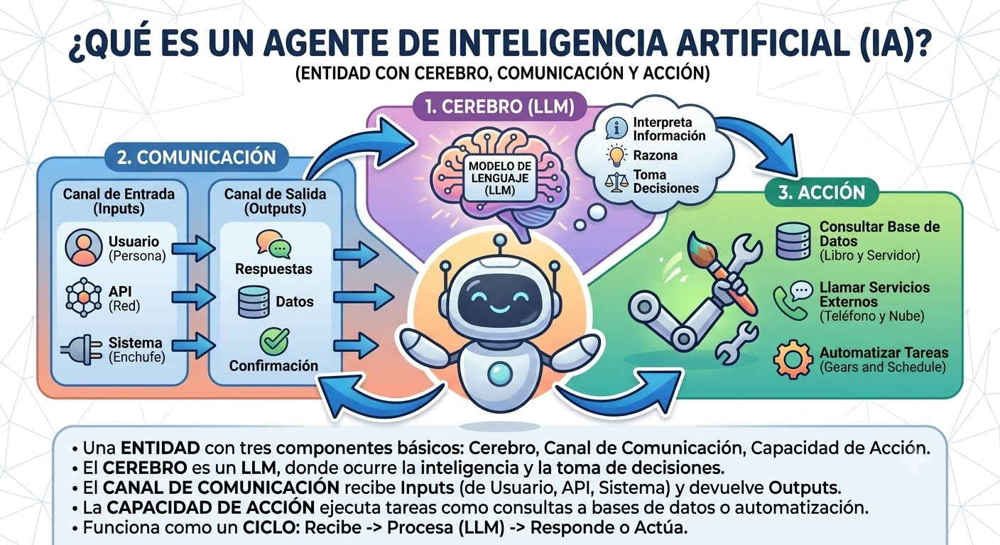
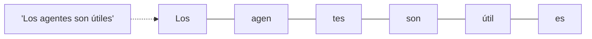
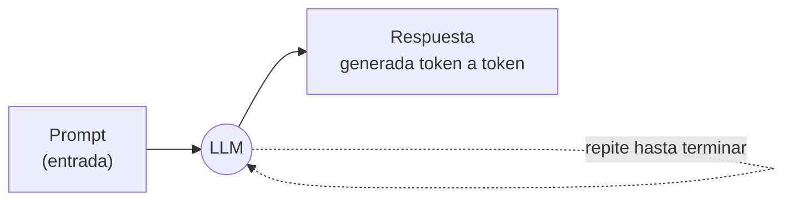
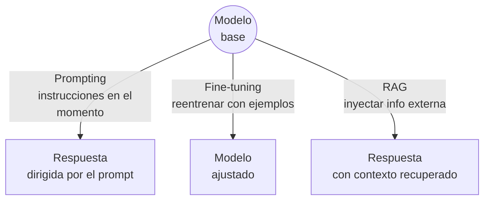
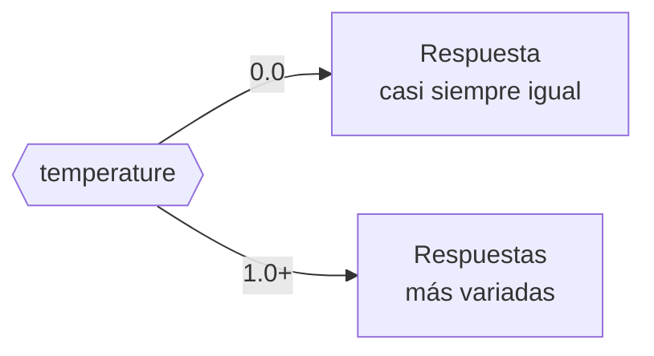
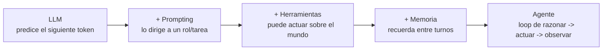

# Módulo 0 — Panorama general: de un LLM a un agente (Orientación)

<figure markdown>

<figcaption>Un agente de IA como entidad con tres componentes: cerebro (LLM), canal de comunicación y capacidad de acción.</figcaption>
</figure>

!!! abstract "Tema central"
    Antes de entrar en el detalle técnico del [Módulo 1](01-fundamentos.md), este módulo da una vista panorámica: qué es un LLM en términos generales, cómo se llega de "modelo que predice texto" a "agente que actúa", y un mapa del ecosistema (modelos, frameworks, proveedores) que se usa durante todo el curso.

!!! info "Es orientación, no consume una semana"
    Pensado para repasar los conceptos generales de LLMs antes de la Semana 1, o como sesión de bienvenida/nivelación para quien dicta el curso. No forma parte de las 12 semanas del cronograma — es el Módulo 0 a propósito.

!!! tip "Nodo dice"
    Si nunca tocaste un LLM más allá de un chat tipo ChatGPT, quedate tranquilo: no hace falta background en machine learning para este curso. Solo necesitás estas ideas generales — y para eso está este módulo.

## Objetivos de aprendizaje

- [ ] Explicar en una frase qué es un LLM y cómo genera texto (predicción del siguiente token).
- [ ] Diferenciar prompting, fine-tuning y RAG como formas de "dirigir" un modelo.
- [ ] Describir, a alto nivel, qué transforma un LLM en un agente.
- [ ] Ubicar las piezas del ecosistema (modelo, framework, vector store, observabilidad) que se usan en el curso.

## Qué es un LLM, en términos generales

Un LLM (Large Language Model / modelo de lenguaje grande) es un modelo entrenado para predecir, dado un texto, cuál es la unidad de texto (*token*) más probable que sigue. Ese mecanismo simple, escalado a miles de millones de parámetros y entrenado sobre enormes cantidades de texto, termina siendo capaz de razonar, resumir, traducir y programar — no porque "entienda" en el sentido humano, sino porque predecir bien el siguiente token a esa escala requiere haber capturado patrones muy ricos del lenguaje y del conocimiento.

#### Token

La unidad mínima de texto que el modelo procesa (no siempre es una palabra completa).



#### Inferencia

El proceso de generar una respuesta a partir de un prompt, token a token — lo que corre localmente con Ollama en este curso.



#### Prompting vs. fine-tuning vs. RAG

Tres formas distintas de dirigir o mejorar la respuesta de un mismo modelo base, sin que se excluyan entre sí:

- *Prompting* = dirigir el comportamiento con instrucciones en el momento, sin tocar el modelo.
- *Fine-tuning* = reentrenar el modelo con ejemplos para cambiar su comportamiento de base.
- *RAG (Retrieval-Augmented Generation)* = recuperar información externa relevante (ej. de un vector store) e inyectarla en el prompt antes de generar la respuesta — se ve en detalle en el [Módulo 3](03-memoria-y-estado.md).

El curso usa casi exclusivamente prompting (y RAG desde el Módulo 3): es gratis, rápido de iterar, y no requiere GPU de entrenamiento.



#### Temperature

Parámetro que controla cuán determinista o variada es la salida.



!!! tip "Nodo dice"
    Para el agente del proyecto sincrónico, `temperature` baja (0-0.3) suele andar mejor: querés que decida de forma consistente cuándo usar una herramienta, no que sea "creativo" con eso. Guardá la temperature alta para tareas de redacción, no de decisión.

## De LLM a agente: el panorama



Este diagrama es, en miniatura, el mapa del curso completo: cada flecha es aproximadamente uno de los primeros módulos (Módulo 1: el loop; Módulo 2: herramientas; Módulo 3: memoria). Nada de esto es magia nueva — es un LLM más estructura alrededor.

## El ecosistema del curso, de un vistazo

| Pieza | Qué resuelve | Se ve en detalle en |
|---|---|---|
| Modelo (Ollama + Llama/Qwen/Mistral) | Generar texto y decisiones | Todo el curso |
| Prompting / system prompts | Dirigir el comportamiento del modelo | [Módulo 1](01-fundamentos.md) |
| Tool calling | Que el modelo pueda actuar (buscar, calcular, escribir) | [Módulo 2](02-herramientas.md) |
| Vector store (ChromaDB) | Memoria de largo plazo | [Módulo 3](03-memoria-y-estado.md) |
| LangGraph | Controlar el flujo como grafo, no como loop implícito | [Módulos 4-5](04-langgraph-I.md) |
| Multiagente | Dividir el trabajo entre roles especializados | [Módulos 6-8](06-multiagente-fundamentos.md) |
| CrewAI / AutoGen | Alternativas de más alto nivel a LangGraph | [Módulo 9](09-frameworks-alternativos.md) |
| Langfuse | Ver qué hizo el agente y por qué | [Módulos 10-11](10-evaluacion-confiabilidad.md) |

## Actividad práctica: primer contacto (sin código de agente todavía)

El objetivo de este módulo no es programar un agente — es perder el miedo a la herramienta base. Alcanza con:

```bash
ollama pull llama3.1:8b
ollama run llama3.1:8b
```

Y ya dentro del prompt interactivo, probar:

- Pedir lo mismo dos veces y observar si la respuesta cambia — sirve para "sentir" qué hace `temperature`.
- Dar una instrucción de rol ("Respondé siempre en una sola oración") y ver cuánto la respeta.
- Pedir algo que requiere un dato actual (ej. "¿qué día es hoy?") y observar que el modelo **no lo sabe** — ese es exactamente el problema que el Módulo 1 resuelve con el loop de agente.

## Videos recomendados

<div class="video-embed" data-yt-id="_9VSDr2k3r4" data-title="Introducción a los grandes modelos de lenguaje (LLM)"></div>

**[Introducción a los grandes modelos de lenguaje (LLM)](https://www.youtube.com/watch?v=_9VSDr2k3r4)** — (en español). Explica qué son los LLM, cómo se entrenan y se personalizan, en términos accesibles para quien recién arranca.

Más videos sobre este módulo:

| Video | Canal / Fuente | Por qué verlo |
|---|---|---|
| [¿Qué son los LLM? + Introducción básica a prompts](https://www.youtube.com/watch?v=5pTPm08BRCw) | — (en español) | Cubre LLMs y prompting básico juntos — buen punto de partida antes del Módulo 1. |
| [What are AI agents?](https://www.youtube.com/watch?v=3zgm60bXmQk) | Microsoft — serie "AI Agents for Beginners" | Explica el concepto general de agente sin atarse a un framework específico. |
| [Tutorial Ollama en Español: Tu LLM Privado en Casa](https://www.youtube.com/watch?v=WkouIQBB1GI) | — (en español) | Acompaña la actividad práctica de este módulo: instalar y correr un modelo local paso a paso. |

## Notas para el instructor

- Útil como nivelación si el grupo tiene niveles dispares de familiaridad con LLMs — puede acortarse a una charla de 15 minutos si todo el grupo ya conoce los conceptos base.
- No introduce todavía el loop ReAct ni tool calling en detalle — es intencional, se reserva para el Módulo 1 y el Módulo 2 respectivamente. Acá el objetivo es vocabulario e intuición general, no implementación.
- Si el grupo ya tiene experiencia previa con LLMs (ej. uso de ChatGPT/Claude a nivel usuario), este módulo puede resumirse solo a la actividad práctica de Ollama.

## Checklist de cierre del módulo

- [ ] Cada participante corrió al menos un modelo local con Ollama desde la terminal.
- [ ] El grupo puede explicar la diferencia entre prompting y fine-tuning.
- [ ] El grupo identificó, en el diagrama LLM → Agente, en qué escalón está parado antes de empezar el Módulo 1.
