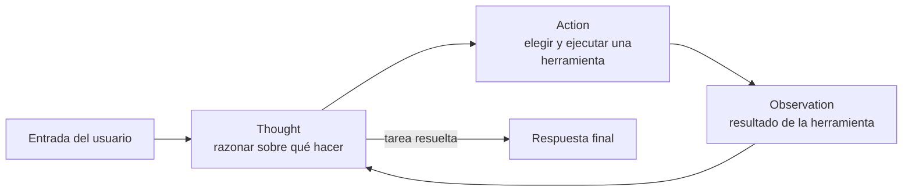
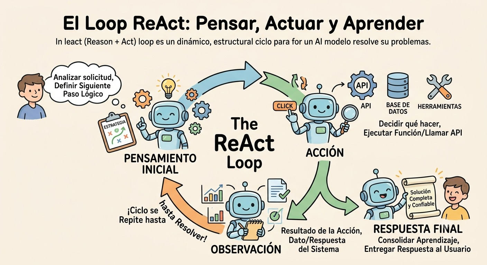

# Módulo 1 — Fundamentos (Semana 1)

!!! abstract "Tema central"
    Qué es un agente, el loop ReAct, y cómo escribir prompts que le permitan a un LLM decidir *cuándo actuar*, no solo *qué responder*.

**Antes de empezar:** revisar el [glosario de conceptos clave](../recursos/glosario.md) — este módulo introduce esos términos por primera vez.

## Objetivos de aprendizaje

Al final de la semana, cada participante debería poder:

- [ ] Explicar la diferencia entre un chatbot (llamada única) y un agente (loop con estado y herramientas).
- [ ] Dibujar de memoria el ciclo ReAct (Reason → Act → Observe).
- [ ] Escribir un system prompt de rol que condicione cuándo el modelo debe "actuar" vs. responder directo.
- [ ] Correr un agente mínimo, sin framework, sobre un modelo local con Ollama.

## El loop ReAct



La diferencia clave frente a una sola llamada al LLM: el modelo puede **observar el resultado de su propia acción** antes de decidir el siguiente paso, en vez de generar toda la respuesta de una sola pasada.

<figure markdown>

<figcaption>El ciclo ReAct en cuatro pasos: pensamiento inicial, acción (llamar una herramienta/API), observación del resultado, y respuesta final — repitiendo hasta resolver la tarea.</figcaption>
</figure>

!!! tip "Nodo dice"
    Si te cuesta recordar el orden, pensalo como vos mismo investigando algo: pensás qué buscar (*Thought*), buscás (*Action*), leés el resultado (*Observation*), y recién ahí decidís si ya sabés la respuesta o necesitás buscar de nuevo. El agente hace exactamente eso, un paso a la vez.

## Desglose diario

| Día | Tema | Actividad práctica |
|---|---|---|
| 1 | Qué es un agente vs. un chatbot | Comparar una llamada simple vs. un loop con condición de parada |
| 2 | El loop ReAct explicado paso a paso | Trazar a mano un ejemplo de ReAct en papel/pizarra |
| 3 | Prompting para agentes (system prompts de rol) | Escribir el system prompt del primer agente del proyecto |
| 4 | Primer agente sin framework (Python + Ollama) | Codear un agente que responde y decide cuándo "actuar" (print simulado), usando un modelo local |
| 5 | Cierre: cuándo NO usar un agente | Debate + kickoff oficial del [proyecto sincrónico](../proyecto-sincronico.md) |

### Día 1 — Agente vs. chatbot

Un chatbot típico es `entrada → LLM → salida`: una única llamada, sin capacidad de verificar nada por su cuenta. Un agente agrega un **loop con condición de parada**: el modelo puede decidir "necesito más información" y volver a llamar al LLM con nueva evidencia, en vez de responder de inmediato. La actividad de comparación funciona mejor mostrando primero el *fallo* del enfoque simple (ej. una pregunta que requiere un dato actual que el modelo no tiene) antes de introducir el agente.

### Día 3 — System prompts de rol

Un buen system prompt para agentes no solo define personalidad — define **cuándo actuar**. Ejemplo mínimo:

```text
Sos un asistente de investigación. Tenés acceso a una herramienta de búsqueda web.
Reglas:
- Si la pregunta requiere un dato que podría haber cambiado (fechas, precios, eventos recientes), usá la herramienta antes de responder.
- Si podés responder con certeza sin buscar, respondé directo.
- Nunca afirmes haber buscado algo si no llamaste a la herramienta.
```

### Día 4 — Primer agente sin framework

Ejemplo de loop ReAct manual, sin ningún framework, usando el SDK de `ollama` directo:

```python
import ollama

MODEL = "llama3.1:8b"

def buscar_web(query: str) -> str:
    # Placeholder: en el Día 10 (Módulo 2) esto se conecta a DuckDuckGo Search real
    return f"[resultado simulado para: {query}]"

def agente(pregunta: str, max_pasos: int = 3) -> str:
    mensajes = [
        {
            "role": "system",
            "content": """
Eres un agente de inteligencia artificial.

Personalidad:
- Siempre eres amable, respetuoso y profesional.
- Saluda solo cuando sea apropiado.
- Responde de forma clara, breve y precisa.
- Usa un lenguaje sencillo y cordial.
- Evita respuestas demasiado largas.

Reglas:
- Si necesitas información actual, responde SOLO con:
  BUSCAR: <consulta>
- Nunca digas que no tienes acceso a internet.
- Si ya conoces la respuesta, respóndela directamente.
- Cuando recibas el resultado de una búsqueda, úsalo para responder al usuario.
"""
        },
        {"role": "user", "content": pregunta},
    ]

    for paso in range(max_pasos):

        respuesta = ollama.chat(
            model=MODEL,
            messages=mensajes
        )["message"]["content"]

        print(f"Paso {paso+1} → {respuesta}")

        if "no tengo acceso" in respuesta.lower():
            respuesta = f"BUSCAR: {pregunta}"

        if respuesta.startswith("BUSCAR:"):

            consulta = respuesta.replace("BUSCAR:", "").strip()

            observacion = buscar_web(consulta)

            print(f"🔍 Buscando: {consulta}")
            print(f"📥 Resultado: {observacion}")

            mensajes.append({"role": "assistant", "content": respuesta})

            mensajes.append({
                "role": "user",
                "content": f"Resultado de la búsqueda: {observacion}"
            })

            continue

        return respuesta

    return "No se pudo resolver en el límite de pasos."
```

Este es exactamente el loop del diagrama de arriba, escrito a mano — sin LangGraph, sin tool calling estructurado todavía. Eso viene en los módulos 2 y 4. El system prompt ahora separa **personalidad** (cómo responde) de **reglas** (cuándo actuar), y el chequeo de `"no tengo acceso"` es una red de seguridad extra por si el modelo, en vez de seguir el formato `BUSCAR:`, cae en la tentación de decir directamente que no puede buscar en internet.

## Videos recomendados

<div class="video-embed" data-yt-id="D7_ipDqhtwk" data-title="How We Build Effective Agents — Barry Zhang, Anthropic"></div>

**[How We Build Effective Agents — Barry Zhang, Anthropic](https://www.youtube.com/watch?v=D7_ipDqhtwk)** — AI Engineer (AI Engineer Summit 2025). Referencia canónica de Anthropic sobre cuándo un agente es la herramienta correcta vs. un flujo determinista — buen marco conceptual para abrir el curso.

Más videos sobre este módulo:

| Video | Canal | Por qué verlo |
|---|---|---|
| [ReAct AI Agents, clearly explained!](https://www.youtube.com/watch?v=vFdIrZyKEwQ) | — | Explicación corta y directa del patrón Thought → Action → Observation. |
| [Understanding ReACT with LangChain](https://www.youtube.com/watch?v=Eug2clsLtFs) | — | Incluye notebook de Colab; sirve como demo práctica del loop ReAct antes de introducir frameworks. |

## Ejercicio práctico

Tomá el agente mínimo del Día 4 y modificá el system prompt para que, además de decidir cuándo buscar, el modelo tenga que responder **siempre en una sola oración**, sin importar el camino que tome (con o sin `BUSCAR:`).

??? success "Ver solución"
    ```python
    mensajes = [
        {
            "role": "system",
            "content": """
Eres un agente de inteligencia artificial.

Personalidad:
- Siempre eres amable, respetuoso y profesional.
- Saluda solo cuando sea apropiado.
- Usa un lenguaje sencillo y cordial.

Reglas:
- Si necesitas información actual, responde SOLO con:
  BUSCAR: <consulta>
- Nunca digas que no tienes acceso a internet.
- Si ya conoces la respuesta, respóndela directamente.
- Cuando recibas el resultado de una búsqueda, úsalo para responder al usuario.
- Tu respuesta final debe ser siempre una sola oración, sin excepciones,
  tengas o no que buscar antes.
"""
        },
        {"role": "user", "content": pregunta},
    ]
    ```
    La restricción de formato ("una sola oración") se agrega como una regla más, en la misma sección de Reglas — conviven ahí la regla de cuándo buscar y la regla de formato de salida, sin pisarse.

## Autoevaluación

<div class="mc-quiz" markdown>
¿Cuál es la diferencia clave entre un chatbot de una sola llamada y un agente con loop ReAct?

- [ ] El agente usa un modelo más grande.
- [x] El agente puede observar el resultado de su propia acción antes de decidir el siguiente paso.
- [ ] El chatbot no puede usar system prompts.
</div>

<div class="mc-quiz" markdown>
En el loop ReAct, ¿qué viene justo después de "Action"?

- [ ] Thought, siempre se repite el pensamiento antes de actuar.
- [x] Observation — el resultado de la acción ejecutada.
- [ ] La respuesta final, sin pasos intermedios.
</div>

<div class="mc-quiz" markdown>
¿Por qué conviene mostrar primero el *fallo* de una sola llamada al LLM, antes de introducir el agente?

- [x] Para que se note claramente qué problema resuelve el loop de agente.
- [ ] Porque una sola llamada es más lenta de programar.
- [ ] Porque los agentes nunca pueden fallar.
</div>

## Checklist de cierre del módulo

- [ ] El grupo puede explicar ReAct sin mirar el diagrama.
- [ ] Cada participante corrió el agente mínimo del Día 4 localmente con Ollama.
- [ ] El proyecto sincrónico tiene su primer commit en `fase-1-agente-simple/`.
