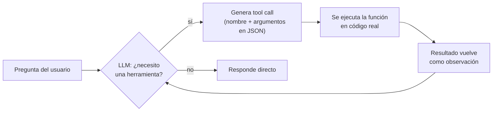

# Módulo 2 — Herramientas / Tool Calling (Semana 2)

!!! abstract "Tema central"
    Tool calling / function calling: cómo un LLM decide *qué* función invocar y con *qué* argumentos, de forma estructurada, y qué hacer cuando esa herramienta falla.

## Cómo decide el modelo cuándo usar una herramienta



Es el mismo loop del [Módulo 1](01-fundamentos.md) — lo único nuevo es que la "acción" ahora es una llamada de función estructurada, no texto libre parseado a mano.

## Objetivos de aprendizaje

- [ ] Escribir un esquema (JSON Schema) claro para una herramienta, con nombre y descripción sin ambigüedad.
- [ ] Explicar qué pasa "por debajo" cuando el modelo llama una función (no es magia: es JSON estructurado).
- [ ] Manejar el caso en que una herramienta falla o devuelve un error.
- [ ] Encadenar más de una llamada a herramientas en un mismo turno.

## Desglose diario

| Día | Tema |
|---|---|
| 6 | Qué es function/tool calling y cómo lo implementa cada proveedor |
| 7 | Diseño de esquemas de herramientas (JSON schema, nombres claros, descripciones) |
| 8 | Manejo de errores de herramientas (qué hace el agente si la tool falla) |
| 9 | Encadenar múltiples llamadas a herramientas en un mismo turno |
| 10 | Práctica: dar al agente del proyecto su primera herramienta real (búsqueda web con DuckDuckGo Search) |

### Día 6-7 — De texto libre a tool calling estructurado

En el Módulo 1 el agente decidía actuar devolviendo el texto `BUSCAR: ...`, que después se parseaba a mano. El tool/function calling nativo reemplaza ese parseo frágil por un esquema estructurado que el modelo respeta:

!!! tip "Nodo dice"
    "JSON Schema" suena más complicado de lo que es: es solo una forma estandarizada de describir la forma de un dato (qué campos tiene, de qué tipo es cada uno, cuáles son obligatorios). Acá se usa para describirle al modelo la forma que debe tener el argumento de una función — nada más.

```python
herramienta_busqueda = {
    "type": "function",
    "function": {
        "name": "buscar_web",
        "description": "Busca información actual en la web. Usar solo si la pregunta requiere datos que pueden haber cambiado recientemente.",
        "parameters": {
            "type": "object",
            "properties": {
                "query": {
                    "type": "string",
                    "description": "La consulta de búsqueda, en lenguaje natural y específica.",
                }
            },
            "required": ["query"],
        },
    },
}
```

!!! tip "Nombres y descripciones son el prompt real"
    El modelo no ve el código de la función — solo ve `name`, `description` y `parameters`. Una descripción ambigua ("busca cosas") produce tool calling errático aunque la función funcione perfecto.

### Día 8 — Manejo de errores de herramientas

El agente debe recibir el error como una observación más, no como una excepción que rompe el loop:

```python
def ejecutar_herramienta(nombre: str, argumentos: dict) -> str:
    try:
        if nombre == "buscar_web":
            return buscar_web(**argumentos)
        return f"Error: herramienta '{nombre}' no existe."
    except Exception as e:
        return f"Error ejecutando '{nombre}': {e}"
    # El string de error se devuelve al modelo como "observation",
    # para que decida si reintentar, usar otra herramienta, o avisar al usuario.
```

### Día 10 — Primera herramienta real del proyecto

```python
from duckduckgo_search import DDGS

def buscar_web(query: str, max_resultados: int = 3) -> str:
    with DDGS() as ddgs:
        resultados = list(ddgs.text(query, max_results=max_resultados))
    return "\n".join(f"- {r['title']}: {r['body']}" for r in resultados)
```

Esta función reemplaza el placeholder simulado del Módulo 1 — mismo loop, primera herramienta con efecto real.

## Videos recomendados

<div class="video-embed" data-yt-id="2HsmNeT8TCg" data-title="Claude Function Calling Made Dead Simple (Anthropic Tool Use)"></div>

**[Claude Function Calling Made Dead Simple (Anthropic Tool Use)](https://www.youtube.com/watch?v=2HsmNeT8TCg)** — Tutorial enfocado en tool use vía API, útil para ver el flujo completo request → tool call → resultado.

Más videos sobre este módulo:

| Video | Canal | Por qué verlo |
|---|---|---|
| [Getting Started with Tool Use in the Anthropic API](https://www.youtube.com/watch?v=7xVmf9lIj14) | — | Introducción directa a Tool Use, cubre el formato del esquema. |
| [LLM Function Calling - AI Tools Deep Dive](https://www.youtube.com/watch?v=gMeTK6zzaO4) | — | Cubre function calling de forma agnóstica al proveedor. |

!!! note "Sobre los videos de este módulo"
    No se encontraron tutoriales recientes de buena calidad en español específicos sobre tool calling; los recomendados están en inglés — dado que la audiencia son desarrolladores con experiencia, no debería ser una barrera.

## Ejercicio práctico

Escribí el tool schema (JSON Schema) para una herramienta `calcular(expresion: str)` que evalúa una expresión matemática simple, ej. `"12 * (4 + 1)"`.

??? success "Ver solución"
    ```python
    herramienta_calculadora = {
        "type": "function",
        "function": {
            "name": "calcular",
            "description": "Evalúa una expresión matemática simple (suma, resta, multiplicación, división, paréntesis) y devuelve el resultado numérico.",
            "parameters": {
                "type": "object",
                "properties": {
                    "expresion": {
                        "type": "string",
                        "description": "La expresión matemática a evaluar, ej. '12 * (4 + 1)'.",
                    }
                },
                "required": ["expresion"],
            },
        },
    }
    ```

## Autoevaluación

<div class="mc-quiz" markdown>
¿Qué ve el modelo de una herramienta cuando decide si usarla?

- [ ] El código fuente completo de la función.
- [x] El `name`, la `description` y los `parameters` del esquema.
- [ ] Los logs de ejecuciones anteriores de esa herramienta.
</div>

<div class="mc-quiz" markdown>
¿Qué debería pasar si una herramienta falla al ejecutarse?

- [ ] El programa debe detenerse inmediatamente con una excepción sin manejar.
- [x] El error se devuelve al modelo como una observación más, para que decida cómo seguir.
- [ ] Hay que reiniciar el agente desde cero.
</div>

<div class="mc-quiz" markdown>
Según el módulo, ¿todos los modelos locales de Ollama soportan tool calling nativo por igual?

- [ ] Sí, es una característica universal de cualquier modelo.
- [x] No — modelos como `llama3.1` o `qwen2.5` lo soportan bien, pero no es garantizado para todos.
- [ ] No, hace falta siempre una API paga para tool calling.
</div>

## Checklist de cierre del módulo

- [ ] Cada participante escribió al menos un esquema de herramienta desde cero.
- [ ] El agente del proyecto maneja el caso de error de herramienta sin romperse.
- [ ] La Fase 1 del proyecto sincrónico tiene búsqueda web real (no simulada).
