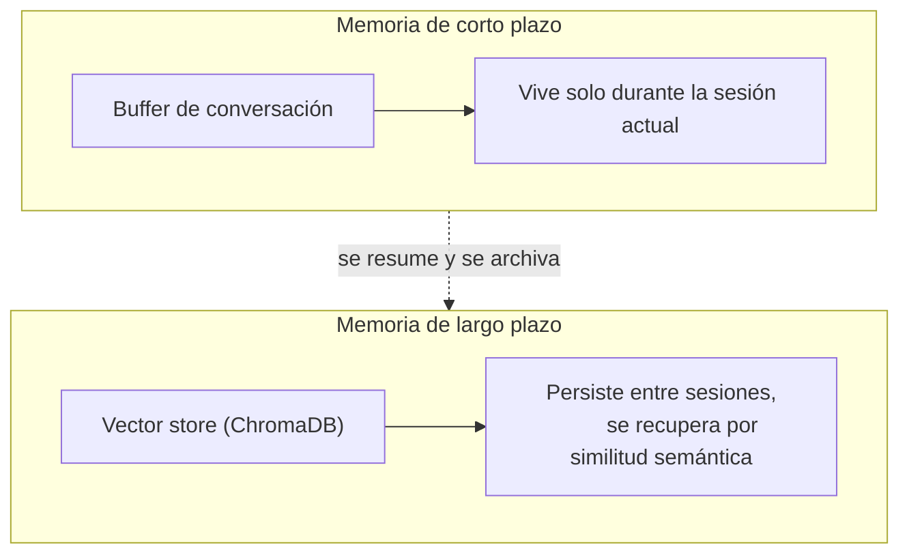

# Módulo 3 — Memoria y estado (Semana 3)

!!! abstract "Tema central"
    Contexto de corto plazo vs. memoria de largo plazo, y RAG básico como forma de darle al agente "memoria externa" sin depender de reentrenar el modelo.

## Objetivos de aprendizaje

- [ ] Distinguir contexto (lo que cabe en la ventana actual) de memoria (lo que persiste entre sesiones).
- [ ] Guardar y recuperar información con ChromaDB usando embeddings.
- [ ] Explicar qué es "contexto contaminado" y por qué más memoria no siempre es mejor.

## Corto plazo vs. largo plazo



## Desglose diario

| Día | Tema |
|---|---|
| 11 | Memoria de corto plazo (buffer de conversación) |
| 12 | Memoria de largo plazo (resúmenes, vector stores) |
| 13 | RAG básico como forma de "memoria externa" (con ChromaDB) |
| 14 | Cuándo la memoria genera problemas (contexto contaminado) |
| 15 | Práctica: el agente del proyecto recuerda hallazgos de investigaciones previas |

### Día 12-13 — Memoria de largo plazo con ChromaDB

```python
import chromadb

cliente = chromadb.PersistentClient(path="./memoria_agente")
coleccion = cliente.get_or_create_collection("investigaciones")

def guardar_hallazgo(id_doc: str, texto: str, metadata: dict):
    coleccion.add(documents=[texto], ids=[id_doc], metadatas=[metadata])

def recuperar_relevante(consulta: str, n: int = 3) -> list[str]:
    resultados = coleccion.query(query_texts=[consulta], n_results=n)
    return resultados["documents"][0]
```

En el agente, esto se usa como un paso previo al razonamiento: antes de responder, se recuperan los `n` hallazgos más relevantes y se inyectan en el contexto — es RAG aplicado a la memoria propia del agente, no a documentos externos.

### Día 14 — Contexto contaminado

!!! warning "Más memoria no es gratis"
    Inyectar hallazgos irrelevantes o desactualizados en el contexto puede degradar la respuesta aunque el dato correcto también esté ahí — el modelo puede "distraerse" con lo irrelevante. Filtrar por relevancia (similitud + recencia) es tan importante como guardar la información en primer lugar.

## Videos recomendados

| Video | Canal | Por qué verlo |
|---|---|---|
| [ChromaDB Crash course in 20 minutes](https://www.youtube.com/watch?v=cm2Ze2n9lxw) | — | Crash course directo: crear, guardar y consultar vectores en ChromaDB, con repo de código. |
| [Storing and Using Long-Term Memory in AI Agents with LangGraph](https://www.youtube.com/watch?v=iVtVsI4UTfo) | — | Cubre memoria de largo plazo en agentes, adelanta conceptos que se retoman en el Módulo 4-5 con LangGraph. |
| [Agent Memory: Long-Term Memory in LangGraph](https://www.youtube.com/watch?v=MkgvJzgJc4s) | — | Repaso de los tipos de memoria en agentes (episódica, semántica, procedural). |

## Notas para el instructor

- ChromaDB corre embebido, sin servidor externo — ideal para que cada participante lo levante local sin fricción.
- El Día 15 corresponde a la Fase 2 del proyecto sincrónico (`proyecto-sincronico/fase-2-memoria/`).

## Checklist de cierre del módulo

- [ ] Cada participante tiene una colección de ChromaDB local funcionando.
- [ ] El agente del proyecto recupera hallazgos previos antes de investigar de nuevo el mismo tema.
- [ ] El grupo puede dar un ejemplo concreto de contexto contaminado.
