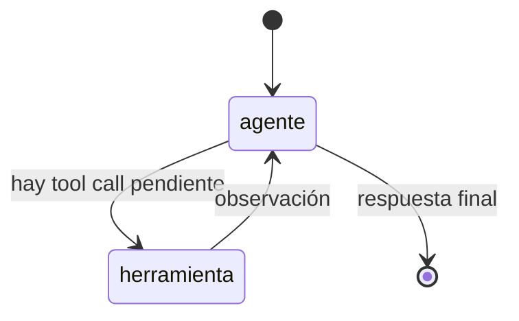

# Módulo 4 — LangGraph I (Semana 4)

!!! abstract "Tema central"
    Modelar agentes como grafos de estado: nodos, aristas y aristas condicionales, en vez de un loop `while` escrito a mano.

## Objetivos de aprendizaje

- [ ] Explicar por qué un grafo de estado da más control que un loop implícito.
- [ ] Definir un `State` (TypedDict) compartido entre nodos.
- [ ] Escribir una arista condicional (branching) según el contenido del estado.
- [ ] Migrar el agente del proyecto de loop manual a LangGraph.

## Del loop manual al grafo



Este es el mismo loop ReAct del [Módulo 1](01-fundamentos.md), pero ahora cada caja es un **nodo** explícito y las flechas son **aristas condicionales** evaluadas por código, no por un `if` perdido en medio de la función.

## Desglose diario

| Día | Tema |
|---|---|
| 16 | Por qué modelar agentes como grafos de estado |
| 17 | Nodos, aristas y el objeto `State` |
| 18 | Aristas condicionales (branching) |
| 19 | Migrar el agente del proyecto de loop manual a LangGraph |
| 20 | Debug de grafos: visualización del flujo |

### Día 17-18 — El grafo mínimo

```python
from typing import TypedDict, Annotated
from langgraph.graph import StateGraph, END
from langgraph.graph.message import add_messages
from langchain_ollama import ChatOllama

class State(TypedDict):
    messages: Annotated[list, add_messages]

modelo = ChatOllama(model="llama3.1:8b")

def nodo_agente(state: State) -> State:
    respuesta = modelo.invoke(state["messages"])
    return {"messages": [respuesta]}

def hay_tool_call(state: State) -> str:
    ultimo = state["messages"][-1]
    return "herramienta" if getattr(ultimo, "tool_calls", None) else END

grafo = StateGraph(State)
grafo.add_node("agente", nodo_agente)
grafo.add_node("herramienta", lambda state: state)  # se completa en el Módulo 2 con la tool real
grafo.set_entry_point("agente")
grafo.add_conditional_edges("agente", hay_tool_call, {"herramienta": "herramienta", END: END})
grafo.add_edge("herramienta", "agente")

app = grafo.compile()
```

Comparado con el loop manual del Módulo 1, lo que cambia no es el comportamiento — es que ahora el flujo es **inspeccionable**: se puede visualizar, pausar, y (desde el Módulo 5) persistir entre ejecuciones.

!!! tip "Nodo dice"
    `State` es solo un diccionario tipado (`TypedDict`) que define qué información viaja entre los nodos del grafo — pensalo como el "formulario compartido" que cada nodo lee y completa. No hay nada más místico ahí atrás.

### Día 20 — Visualizar el grafo

```python
app.get_graph().draw_mermaid_png(output_file_path="grafo.png")
```

!!! tip "Debug en vivo"
    Mostrar el diagrama generado junto al código ayuda mucho a que el grupo conecte la abstracción (`StateGraph`) con el diagrama mental que ya tienen del loop ReAct.

## Videos recomendados

<div class="video-embed" data-yt-id="LS4pALyrm00" data-title="Crea AGENTES de IA con LangGraph y Python — Introducción"></div>

**[Crea AGENTES de IA con LangGraph y Python — Introducción](https://www.youtube.com/watch?v=LS4pALyrm00)** — (en español). Introducción en español a LangGraph como framework para sistemas de agentes.

Más videos sobre este módulo:

| Video | Canal | Por qué verlo |
|---|---|---|
| [LangChain Academy: Introduction to LangGraph](https://www.youtube.com/watch?v=29XE10U6ooc) | LangChain | Resumen del curso oficial de LangChain Academy sobre LangGraph. |
| [Introducción a LangGraph: Crea Sistemas Multi-agentes en Python](https://www.youtube.com/watch?v=fDCcDkKWabY) | — (en español) | Cubre nodos/grafos como base para lo que se ve en los Módulos 6-8 (multiagente). |

## Notas para el instructor

- LangGraph funciona igual con modelos locales (vía `langchain-ollama`) que con APIs de pago — no hay que cambiar de framework al migrar de un extremo a otro.
- El Día 19 inicia la Fase 3 del proyecto (`proyecto-sincronico/fase-3-langgraph/`).

## Checklist de cierre del módulo

- [ ] Cada participante compiló y corrió un grafo mínimo de 2 nodos.
- [ ] El agente del proyecto corre como `StateGraph`, no como loop manual.
- [ ] El grupo puede leer el diagrama de un grafo ajeno y explicar el flujo.
