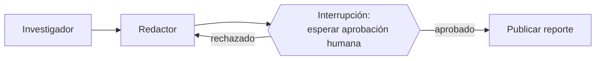

# Módulo 5 — LangGraph II (Semana 5)

!!! abstract "Tema central"
    Ciclos dentro del grafo, checkpoints y persistencia de estado, y human-in-the-loop mediante interrupciones.

## Objetivos de aprendizaje

- [ ] Usar un `checkpointer` para persistir el estado del grafo entre ejecuciones.
- [ ] Insertar un punto de interrupción que espera aprobación humana antes de continuar.
- [ ] Diseñar una política de reintentos para un nodo que puede fallar.

## Desglose diario

| Día | Tema |
|---|---|
| 21 | Ciclos (loops dentro del grafo) |
| 22 | Checkpoints y persistencia de estado |
| 23 | Human-in-the-loop con interrupciones |
| 24 | Manejo de errores y reintentos dentro del grafo |
| 25 | Práctica: agregar un punto de aprobación humana antes de publicar el reporte |

### Día 22 — Checkpoints

```python
from langgraph.checkpoint.memory import MemorySaver

checkpointer = MemorySaver()
app = grafo.compile(checkpointer=checkpointer)

config = {"configurable": {"thread_id": "investigacion-42"}}
app.invoke({"messages": [("user", "Investigá el estado del mercado de EVs")]}, config)
```

El `thread_id` identifica una conversación/ejecución específica — el grafo puede pausarse y retomarse exactamente donde quedó, incluso en otro proceso, mientras el checkpointer persista en algo más durable que memoria (SQLite, Postgres) en producción.

!!! tip "Nodo dice"
    Pensá el `thread_id` como el número de expediente de un trámite: no importa qué empleado (proceso) lo atienda, con ese número cualquiera puede retomarlo exactamente donde quedó. `MemorySaver` es la versión "en RAM" para desarrollo — se pierde al reiniciar, por eso en producción ([Módulo 11](11-produccion.md)) se cambia a algo persistente.

### Día 23 — Human-in-the-loop



```python
grafo.compile(checkpointer=checkpointer, interrupt_before=["publicar"])

# El grafo se detiene antes del nodo "publicar" y devuelve el control.
# Un humano revisa app.get_state(config) y decide:
app.invoke(None, config)  # continuar tal cual
# o modificar el estado antes de continuar:
app.update_state(config, {"reporte": reporte_editado})
```

### Día 24 — Reintentos

!!! tip "Reintentar la herramienta, no todo el grafo"
    Cuando un nodo de herramienta falla (ej. timeout de red), conviene reintentar solo ese nodo con backoff, en vez de reiniciar el grafo completo desde el principio — LangGraph soporta políticas de retry por nodo.

## Videos recomendados

<div class="video-embed" data-yt-id="6t7YJcEFUIY" data-title="LangGraph interrupt: Making it easier to build human-in-the-loop agents"></div>

**[LangGraph interrupt: Making it easier to build human-in-the-loop agents](https://www.youtube.com/watch?v=6t7YJcEFUIY)** — LangChain. Explica la función `interrupt()` y el checkpointing para HITL — el tema central del módulo, del canal oficial.

Más videos sobre este módulo:

| Video | Canal | Por qué verlo |
|---|---|---|
| [LangGraph Agents - Human-In-The-Loop Breakpoints](https://www.youtube.com/watch?v=Za8CrPqQxpA) | — | Cubre breakpoints como patrón de interacción humano-agente, complementario al anterior. |

## Notas para el instructor

- Semana de repaso/buffer sugerida si el grupo se atrasó en el Módulo 4.
- El Día 25 cierra la Fase 3 del proyecto sincrónico.

## Ejercicio práctico

Modificá el ejemplo de checkpoint del Día 22 para que cada usuario tenga su propio `thread_id`, en vez del valor fijo `"investigacion-42"`.

??? success "Ver solución"
    ```python
    def config_para_usuario(usuario_id: str) -> dict:
        return {"configurable": {"thread_id": f"investigacion-{usuario_id}"}}

    config = config_para_usuario("michel")
    app.invoke({"messages": [("user", "Investigá el estado del mercado de EVs")]}, config)
    ```
    Cada usuario obtiene su propio hilo de conversación persistente, sin pisar el de otro.

## Autoevaluación

<div class="mc-quiz" markdown>
¿Para qué sirve `interrupt_before` en LangGraph?

- [ ] Para persistir el estado del grafo en disco automáticamente.
- [x] Para pausar el grafo antes de un nodo y esperar aprobación humana.
- [ ] Para acelerar la ejecución de nodos pesados.
</div>

## Checklist de cierre del módulo

- [ ] El grafo del proyecto persiste estado entre ejecuciones (probado cerrando y reabriendo el proceso).
- [ ] Existe un punto de aprobación humana antes de "publicar" el reporte.
- [ ] El grupo probó qué pasa cuando se rechaza en el punto de aprobación (no solo el camino feliz).
