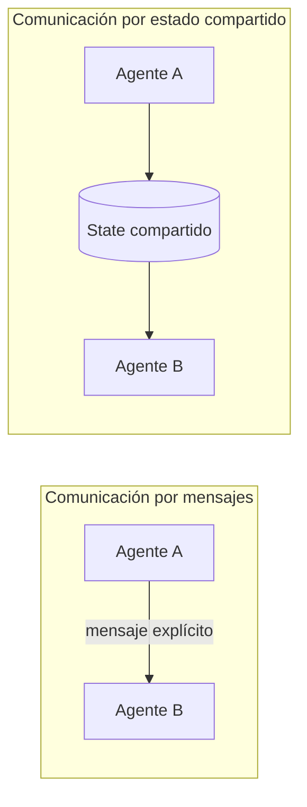

# Módulo 6 — Multiagente: fundamentos (Semana 6)

!!! abstract "Tema central"
    Por qué dividir un agente en varios, cómo diseñar roles con límites claros, y qué cuesta realmente el multiagente (no es gratis).

## Objetivos de aprendizaje

- [ ] Justificar con un ejemplo concreto por qué dos agentes especializados superan a uno generalista en cierta tarea.
- [ ] Diseñar un rol: qué sabe, qué puede hacer, qué NO debe hacer.
- [ ] Distinguir comunicación por mensajes vs. por estado compartido.
- [ ] Nombrar al menos dos costos ocultos de pasar a multiagente.

## Desglose diario

| Día | Tema |
|---|---|
| 26 | Por qué dividir responsabilidades entre agentes |
| 27 | Diseño de roles (qué sabe, qué puede hacer, qué NO debe hacer cada agente) |
| 28 | Comunicación entre agentes: mensajes vs. estado compartido |
| 29 | Costos ocultos del multiagente (latencia, tokens, complejidad) |
| 30 | Práctica: separar el agente único del proyecto en 2 roles (investigador / redactor) |

### Día 27 — Plantilla de diseño de rol

Para cada agente nuevo, completar antes de escribir código:

```markdown
### Agente: Investigador
- Sabe: cómo formular búsquedas efectivas, evaluar si una fuente es confiable.
- Puede hacer: llamar la herramienta de búsqueda web, guardar hallazgos en memoria.
- NO debe: redactar el informe final, decidir qué se publica.
- Recibe de: Supervisor (el tema a investigar).
- Entrega a: Redactor (hallazgos crudos + fuentes).
```

Esta plantilla se completa una vez por cada agente del proyecto (Investigador, Verificador, Redactor, Auditor) durante el Día 30.

!!! tip "Nodo dice"
    El campo "NO debe" es el que más se salta y el que más previene dolores de cabeza después. Si no lo escribís explícito, tarde o temprano un agente termina haciendo el trabajo de otro "porque podía" — y ahí perdés todo el beneficio de haber dividido responsabilidades.

### Día 28 — Mensajes vs. estado compartido



En LangGraph, el patrón dominante es estado compartido: cada agente lee y escribe sobre el mismo objeto `State`, y el grafo decide el orden. Frameworks como AutoGen priorizan mensajes explícitos entre agentes (más parecido a un chat grupal). Ninguno es "mejor" en abstracto — el Módulo 9 compara ambos enfoques en la práctica.

### Día 29 — Costos ocultos

!!! warning "Dividir en agentes no es gratis"
    - **Latencia**: cada agente extra es al menos una llamada más al LLM, en serie o en paralelo.
    - **Tokens**: cada agente repite parte del contexto (rol, instrucciones, historial relevante) — el costo total crece más rápido de lo intuitivo.
    - **Complejidad**: más superficie de fallo (¿qué pasa si el Verificador nunca responde?) y más difícil de debuggear que un solo agente.

    La pregunta correcta no es "¿puedo dividir esto en agentes?" sino "¿el problema tiene sub-tareas con conocimiento/herramientas genuinamente distintos que se benefician de aislarse?".

## Videos recomendados

<div class="video-embed" data-yt-id="Mi5wOpAgixw" data-title="Multi-agent Systems Explained in 17 Minutes"></div>

**[Multi-agent Systems Explained in 17 Minutes](https://www.youtube.com/watch?v=Mi5wOpAgixw)** — Resumen conciso de qué es un sistema multiagente y por qué usar varios agentes en vez de uno.

Más videos sobre este módulo:

| Video | Canal | Por qué verlo |
|---|---|---|
| [Hierarchical multi-agent systems with LangGraph](https://www.youtube.com/watch?v=B_0TNuYi56w) | — | Introduce patrones jerárquicos como base conceptual antes de entrar en orquestación (Módulo 7). |

## Notas para el instructor

- El Día 30 abre la Fase 4 del proyecto sincrónico (`proyecto-sincronico/fase-4-multiagente/`).
- Buen momento para introducir la práctica de registrar decisiones de arquitectura (ADR) en `proyecto-sincronico/decisiones.md`.

## Checklist de cierre del módulo

- [ ] Cada agente del proyecto tiene su plantilla de rol completa (sabe / puede / no debe).
- [ ] El proyecto pasó de 1 a 2 agentes (Investigador / Redactor).
- [ ] El grupo puede nombrar el costo en latencia y tokens de haber agregado el segundo agente.
