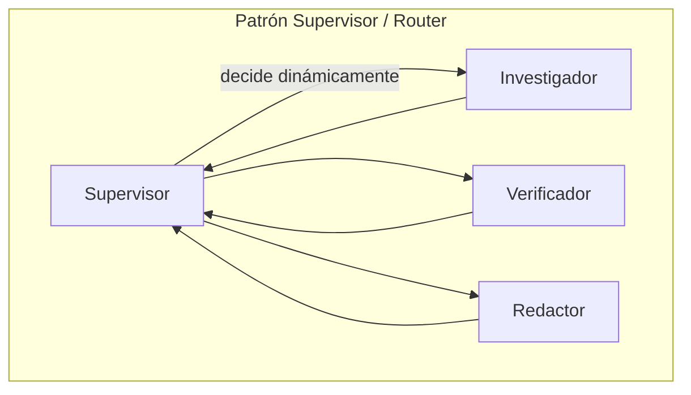
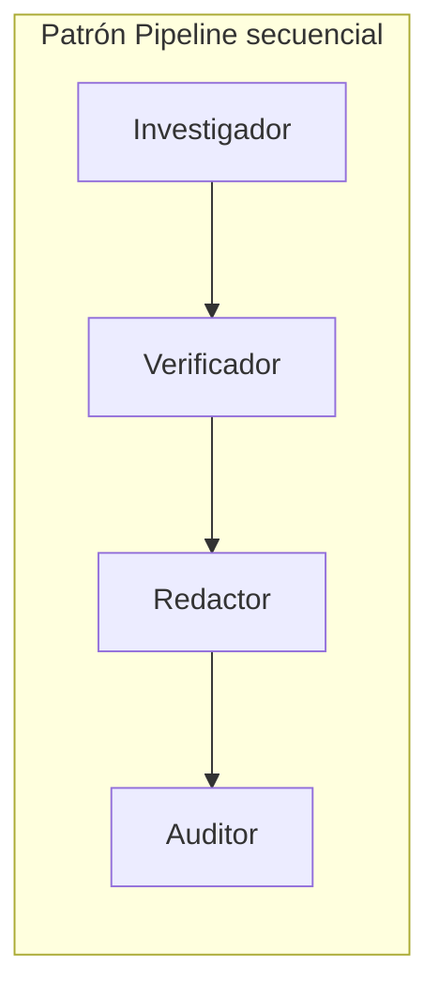

# Módulo 7 — Multiagente: orquestación (Semana 7)

!!! abstract "Tema central"
    Dos formas de coordinar varios agentes: el patrón **Supervisor/Router** (un agente central delega) y el patrón **Pipeline secuencial** (cada agente pasa su output al siguiente).

## Objetivos de aprendizaje

- [ ] Implementar un supervisor que decide a qué agente delegar según el estado actual.
- [ ] Implementar un pipeline secuencial fijo.
- [ ] Elegir el patrón correcto según criterios explícitos, no por preferencia.

## Supervisor vs. Pipeline





## Desglose diario

| Día | Tema |
|---|---|
| 31 | Patrón Supervisor/Router |
| 32 | Patrón Pipeline secuencial |
| 33 | Cuándo usar cada patrón (criterios de decisión) |
| 34 | Implementar el supervisor del proyecto (decide investigador → verificador → redactor) |
| 35 | Práctica guiada + troubleshooting grupal |

### Día 31 — Supervisor mínimo en LangGraph

```python
from typing import Literal

def supervisor(state: State) -> Literal["investigador", "verificador", "redactor", "__end__"]:
    ultimo = state["messages"][-1].content
    if "hallazgos" not in state:
        return "investigador"
    if not state.get("fuentes_verificadas"):
        return "verificador"
    if not state.get("borrador"):
        return "redactor"
    return "__end__"

grafo.add_conditional_edges("supervisor", supervisor)
```

El supervisor no hace el trabajo — solo decide **quién** lo hace a continuación, leyendo el estado compartido. Cada agente delegado vuelve al supervisor al terminar, en vez de pasar directo al siguiente.

!!! tip "Nodo dice"
    Fijate que `supervisor()` es una función de Python común, con `if`s comunes — no hace falta que el supervisor sea "otro LLM pensando" para tomar la decisión. A veces la orquestación más confiable es la más aburrida: código determinista en vez de dejarle la decisión al modelo.

### Día 33 — Criterios de decisión

| Usar Supervisor cuando... | Usar Pipeline cuando... |
|---|---|
| El orden de los pasos puede variar según el caso | El orden es siempre el mismo, sin excepciones |
| Puede hacer falta repetir un paso (ej. re-verificar) | Cada paso se ejecuta exactamente una vez |
| Se necesita lógica de reintento o escalamiento centralizada | La simplicidad y previsibilidad importan más que la flexibilidad |

## Videos recomendados

<div class="video-embed" data-yt-id="HonlBK19F1o" data-title="LangGraph Supervisor Agent: Multi-Agent Orchestration Walkthrough"></div>

**[LangGraph Supervisor Agent: Multi-Agent Orchestration Walkthrough](https://www.youtube.com/watch?v=HonlBK19F1o)** — Walkthrough completo del patrón supervisor con `langgraph-supervisor`.

Más videos sobre este módulo:

| Video | Canal | Por qué verlo |
|---|---|---|
| [LangGraph:20 — Supervisor Multi-Agentic System](https://www.youtube.com/watch?v=ktjJAxaX8rc) | — | Implementación práctica adicional del patrón supervisor/router. |

## Ejercicio práctico

Dado un caso donde el orden de pasos SIEMPRE es el mismo (investigar → verificar → redactar → auditar, sin excepciones ni repeticiones), escribí la versión pipeline con `add_edge` en cadena.

??? success "Ver solución"
    ```python
    grafo.add_edge("investigador", "verificador")
    grafo.add_edge("verificador", "redactor")
    grafo.add_edge("redactor", "auditor")
    grafo.add_edge("auditor", END)
    ```
    Sin supervisor, sin condicionales — cada paso conoce exactamente cuál es el siguiente, porque el caso lo permite.

## Autoevaluación

<div class="mc-quiz" markdown>
¿Qué patrón conviene si puede hacer falta repetir un paso (ej. re-verificar una fuente)?

- [ ] Pipeline secuencial.
- [x] Supervisor/Router.
- [ ] Ninguno — si hay que repetir un paso, hay que rehacer todo el flujo desde cero.
</div>

<div class="mc-quiz" markdown>
¿Quién hace el trabajo real en el patrón Supervisor?

- [ ] El propio supervisor, que resuelve todas las tareas.
- [x] Los agentes delegados — el supervisor solo decide quién actúa a continuación.
- [ ] Nadie: el patrón Supervisor no ejecuta ninguna tarea.
</div>

<div class="mc-quiz" markdown>
¿Qué gana el patrón Pipeline secuencial frente al Supervisor?

- [ ] Más flexibilidad para repetir pasos según el caso.
- [x] Simplicidad y previsibilidad, cuando el orden de los pasos nunca cambia.
- [ ] Nada — el Supervisor siempre es la mejor opción.
</div>

## Checklist de cierre del módulo

- [ ] El proyecto tiene un supervisor funcionando que delega entre al menos 3 agentes.
- [ ] El grupo implementó también la versión pipeline del mismo flujo, aunque sea como ejercicio descartable.
- [ ] Cada participante puede justificar en una frase cuándo usaría cada patrón.
