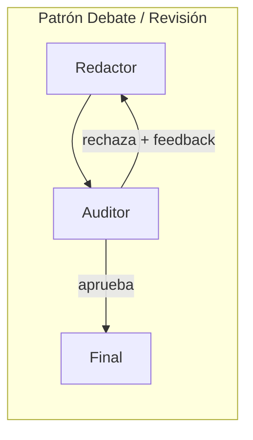
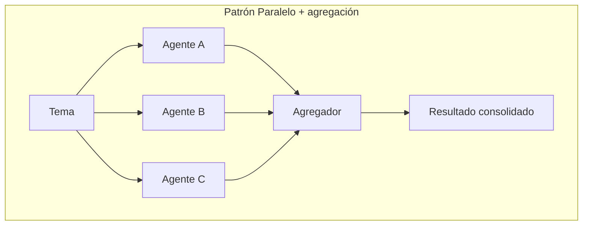

# Módulo 8 — Multiagente: colaboración (Semana 8)

!!! abstract "Tema central"
    Dos patrones de colaboración entre pares: **Debate/Revisión** (agentes se critican entre sí) y **Paralelo con agregación** (resuelven en simultáneo y un agente consolida).

## Objetivos de aprendizaje

- [ ] Implementar un agente "auditor" que revisa el output de otro antes de aprobarlo.
- [ ] Implementar ejecución en paralelo de agentes independientes con agregación final.
- [ ] Diseñar una regla de desempate cuando dos agentes no coinciden.

## Debate vs. Paralelo





## Desglose diario

| Día | Tema |
|---|---|
| 36 | Patrón Debate / revisión por pares |
| 37 | Patrón Paralelo + agregación |
| 38 | Consenso y desempate entre agentes |
| 39 | Práctica: agente "auditor" que revisa el informe antes de entregarlo |
| 40 | Retrospectiva de mitad de curso: qué patrón funcionó mejor y por qué |

### Día 36 — Auditor con ciclo de revisión

```python
def auditor(state: State) -> dict:
    veredicto = modelo.invoke([
        ("system", "Revisá el borrador. Respondé APROBADO o RECHAZADO: <motivo>."),
        ("user", state["borrador"]),
    ])
    aprobado = veredicto.content.startswith("APROBADO")
    return {"aprobado": aprobado, "feedback_auditor": veredicto.content}

def siguiente_paso(state: State) -> str:
    return "publicar" if state["aprobado"] else "redactor"  # vuelve al redactor con feedback
```

Este es el mismo mecanismo de arista condicional del Módulo 4, aplicado a un ciclo de revisión entre dos agentes en vez de entre agente y herramienta.

### Día 37 — Paralelo con agregación

```python
grafo.add_node("agente_a", nodo_a)
grafo.add_node("agente_b", nodo_b)
grafo.add_node("agente_c", nodo_c)
grafo.add_node("agregador", nodo_agregador)

# Las tres ramas parten del mismo punto y convergen en "agregador":
grafo.add_edge("inicio", "agente_a")
grafo.add_edge("inicio", "agente_b")
grafo.add_edge("inicio", "agente_c")
grafo.add_edge("agente_a", "agregador")
grafo.add_edge("agente_b", "agregador")
grafo.add_edge("agente_c", "agregador")
```

LangGraph ejecuta las tres ramas en paralelo cuando no hay dependencia entre ellas, y el nodo `agregador` solo corre cuando las tres terminaron.

### Día 38 — Desempate

!!! tip "Reglas de desempate explícitas, no vibes"
    Cuando el auditor y el redactor no coinciden, definir de antemano la regla: ¿gana el auditor siempre (veto)? ¿se necesita un tercer agente árbitro? ¿escala a un humano? Dejarlo implícito produce loops infinitos de revisión.

## Videos recomendados

<div class="video-embed" data-yt-id="hvAPnpSfSGo" data-title="LangGraph: Multi-Agent Workflows"></div>

**[LangGraph: Multi-Agent Workflows](https://www.youtube.com/watch?v=hvAPnpSfSGo)** — Explica cómo cada agente es un nodo y las aristas definen comunicación (patrón colaborativo vía estado compartido).

Más videos sobre este módulo:

| Video | Canal | Por qué verlo |
|---|---|---|
| [LangGraph:18 — Network / Collaborative Multi-Agent System Implementation](https://www.youtube.com/watch?v=OlxJtmYW5dk) | — | Implementación de un sistema tipo "network" colaborativo, complementario al patrón supervisor del Módulo 7. |

## Notas para el instructor

- Semana de repaso/buffer sugerida.
- El Día 40 es un buen punto de checkpoint de rúbrica: verificar que cada participante pueda explicar los 4 patrones multiagente del [glosario](../recursos/glosario.md).

## Checklist de cierre del módulo

- [ ] El proyecto tiene un agente Auditor con ciclo de revisión funcionando.
- [ ] Se probó (aunque sea en un ejercicio aparte) la ejecución en paralelo con agregación.
- [ ] Existe una regla de desempate escrita, no implícita.
