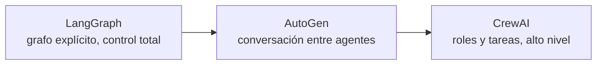

# Módulo 9 — Frameworks alternativos (Semana 9)

!!! abstract "Tema central"
    CrewAI y AutoGen como alternativas de más alto nivel de abstracción que LangGraph, y cuándo conviene cada enfoque.

## Nivel de abstracción, de un vistazo



Más a la izquierda, más control fino pero más código propio. Más a la derecha, menos código pero menos visibilidad sobre el "cuándo" y el "cómo" de cada paso.

## Objetivos de aprendizaje

- [ ] Reimplementar un componente del proyecto en CrewAI.
- [ ] Explicar el modelo conversacional de AutoGen (agentes que se hablan entre sí).
- [ ] Comparar control explícito (LangGraph) vs. velocidad de desarrollo (CrewAI/AutoGen) con argumentos, no solo preferencia.

## Desglose diario

| Día | Tema |
|---|---|
| 41 | Introducción a CrewAI (roles, tasks, crews) |
| 42 | Reimplementar una parte del proyecto en CrewAI |
| 43 | Introducción a AutoGen (conversaciones entre agentes) |
| 44 | Comparativa: LangGraph vs. CrewAI vs. AutoGen (control vs. velocidad de desarrollo) |
| 45 | Debate: ¿qué framework usarían en su equipo y por qué? |

### Día 41-42 — CrewAI: roles, tasks, crews

```python
from crewai import Agent, Task, Crew

investigador = Agent(
    role="Investigador",
    goal="Encontrar información confiable sobre el tema dado",
    backstory="Especialista en research con criterio para evaluar fuentes.",
)

redactor = Agent(
    role="Redactor",
    goal="Convertir hallazgos crudos en un informe claro",
    backstory="Escritor técnico que prioriza claridad sobre extensión.",
)

tarea_investigar = Task(
    description="Investigar: {tema}",
    agent=investigador,
    expected_output="Lista de hallazgos con fuentes",
)
tarea_redactar = Task(
    description="Redactar un informe a partir de los hallazgos",
    agent=redactor,
    expected_output="Informe final en markdown",
)

crew = Crew(agents=[investigador, redactor], tasks=[tarea_investigar, tarea_redactar])
resultado = crew.kickoff(inputs={"tema": "adopción de vehículos eléctricos en 2025"})
```

Frente al supervisor de LangGraph del Módulo 7, CrewAI resuelve la orquestación *por vos*: se declaran roles y tareas, y el framework decide el flujo de ejecución. Se gana velocidad de desarrollo, se pierde control fino sobre el "cuándo" y el "cómo" de cada transición.

!!! tip "Nodo dice"
    Un `Crew` es literalmente eso: un equipo. Le pasás los agentes (con sus roles) y las tareas (qué hay que lograr), y CrewAI arma internamente algo parecido al supervisor que armaron a mano en el Módulo 7 — solo que ya viene resuelto por el framework.

### Día 43 — AutoGen: agentes que conversan

AutoGen modela la colaboración como una conversación de chat entre agentes, no como un grafo de estado — más cercano al patrón "mensajes" del [Módulo 6](06-multiagente-fundamentos.md) que al de "estado compartido" de LangGraph.

### Día 44 — Tabla comparativa

| Criterio | LangGraph | CrewAI | AutoGen |
|---|---|---|---|
| Nivel de abstracción | Bajo (grafo explícito) | Alto (roles/tasks) | Alto (conversación) |
| Control sobre el flujo | Total | Limitado a lo que expone el framework | Limitado, basado en turnos de chat |
| Curva de aprendizaje | Más alta | Baja | Media |
| Mejor para | Producción, flujos con branching complejo | Prototipado rápido, equipos de agentes con roles claros | Simulaciones tipo "equipo que conversa" |

## Videos recomendados

<div class="video-embed" data-yt-id="sPzc6hMg7So" data-title="CrewAI Tutorial: Complete Crash Course for Beginners"></div>

**[CrewAI Tutorial: Complete Crash Course for Beginners](https://www.youtube.com/watch?v=sPzc6hMg7So)** — Introducción completa a CrewAI (agentes basados en roles), con código fuente.

Más videos sobre este módulo:

| Video | Canal | Por qué verlo |
|---|---|---|
| [Microsoft Autogen Crash Course \| Beginner Friendly](https://www.youtube.com/watch?v=ISHEQNUpwTs) | — | Curso introductorio a AutoGen. |
| [AutoGen vs CrewAI vs LangGraph — I Tried Them All So You Don't Have To](https://www.youtube.com/watch?v=Lp-5BYjNqlM) | — | Comparación práctica de los tres frameworks — buen cierre para el Día 44. |

## Notas para el instructor

- CrewAI y AutoGen son ambos open source (igual que LangGraph) — el criterio de comparación es nivel de abstracción, no costo.
- El Día 42 corresponde a la Fase 5 del proyecto (`proyecto-sincronico/fase-5-crewai/`).

## Ejercicio práctico

Agregá una tercera `Task` al ejemplo de CrewAI del Día 41-42: un agente "Verificador" que revisa los hallazgos del Investigador antes de que el Redactor escriba el informe.

??? success "Ver solución"
    ```python
    verificador = Agent(
        role="Verificador",
        goal="Confirmar que los hallazgos citen fuentes confiables",
        backstory="Especialista en chequeo de fuentes, desconfiado por naturaleza.",
    )

    tarea_verificar = Task(
        description="Revisar los hallazgos y descartar los que no tengan fuente confiable",
        agent=verificador,
        expected_output="Lista de hallazgos verificados",
    )

    crew = Crew(
        agents=[investigador, verificador, redactor],
        tasks=[tarea_investigar, tarea_verificar, tarea_redactar],
    )
    ```

## Autoevaluación

<div class="mc-quiz" markdown>
¿Qué gana CrewAI frente al supervisor de LangGraph escrito a mano en el Módulo 7?

- [ ] Más control fino sobre cada transición.
- [x] Velocidad de desarrollo, a costa de control fino sobre el flujo.
- [ ] Nada — ambos enfoques son funcionalmente idénticos.
</div>

## Checklist de cierre del módulo

- [ ] Al menos un componente del proyecto corre en ambas versiones: LangGraph y CrewAI.
- [ ] Cada participante puede nombrar un caso donde elegiría CrewAI/AutoGen por sobre LangGraph, y viceversa.
- [ ] Se completó la Fase 5 del proyecto sincrónico.
