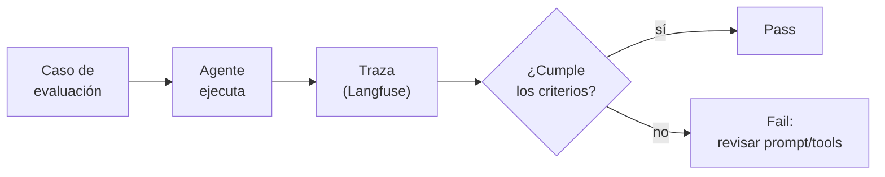

# Módulo 10 — Evaluación y confiabilidad (Semana 10)

!!! abstract "Tema central"
    Testear agentes es distinto a testear software tradicional: no hay un único output correcto. Métricas, detección de alucinaciones/tool misuse, y guardrails.

## El ciclo de evaluación



Sin traza no hay forma confiable de saber *por qué* falló un caso — de ahí que Langfuse sea central en este módulo, no un extra.

## Objetivos de aprendizaje

- [ ] Escribir un set de casos de evaluación con criterio de éxito explícito (no solo "se ve bien").
- [ ] Medir tasa de éxito de tareas y uso correcto de herramientas.
- [ ] Implementar al menos un guardrail de input y uno de output.

## Desglose diario

| Día | Tema |
|---|---|
| 46 | Cómo testear agentes (no es testing tradicional) |
| 47 | Métricas: tasa de éxito de tareas, uso correcto de herramientas |
| 48 | Detección de alucinaciones y "tool misuse" |
| 49 | Guardrails de input/output |
| 50 | Práctica: escribir un set de casos de evaluación para el proyecto |

### Día 46-47 — Por qué el testing tradicional no alcanza

Un `assert resultado == esperado` no funciona cuando la salida es texto generado. En su lugar se evalúa contra criterios:

```python
casos_de_evaluacion = [
    {
        "input": "Investigá el estado del mercado de EVs en Argentina",
        "criterios": [
            "usa la herramienta de búsqueda al menos una vez",
            "el informe cita al menos 2 fuentes",
            "no afirma haber verificado algo que no verificó",
        ],
    },
]

def evaluar_caso(caso: dict, trace: dict) -> dict:
    # trace viene de Langfuse: qué herramientas se llamaron, con qué argumentos, y la salida final
    resultados = {c: None for c in caso["criterios"]}
    resultados["usa la herramienta de búsqueda al menos una vez"] = any(
        span["name"] == "buscar_web" for span in trace["spans"]
    )
    return resultados
```

!!! tip "Nodo dice"
    Una *traza* (trace) es el registro completo de una ejecución de punta a punta; cada paso individual dentro de esa traza (una llamada al LLM, una tool call) es un *span*. Es la misma terminología del [glosario](../recursos/glosario.md) — acá la ves aplicada en código real, no solo en la definición.

### Día 48 — Alucinaciones y tool misuse

Recordar del [glosario](../recursos/glosario.md): alucinar en un agente no es solo "inventar un dato" — incluye llamar una herramienta inexistente, pasar argumentos inválidos, o afirmar que se ejecutó una acción que nunca ocurrió. Detectarlo requiere comparar lo que el agente *dice* que hizo contra la traza real de ejecución (de ahí la importancia de Langfuse en este módulo).

### Día 49 — Guardrails

```python
def guardrail_input(pregunta: str) -> bool:
    # Rechazar antes de gastar un solo token si la entrada es claramente inválida
    return len(pregunta.strip()) > 0 and len(pregunta) < 2000

def guardrail_output(informe: str) -> bool:
    # No publicar si el informe no cita ninguna fuente
    return "http" in informe or "Fuente:" in informe
```

## Videos recomendados

<div class="video-embed" data-yt-id="pTneXS_m1rk" data-title="Langfuse Intro — Observability & Tracing Deep Dive"></div>

**[Langfuse Intro — Observability & Tracing Deep Dive](https://www.youtube.com/watch?v=pTneXS_m1rk)** — (presentado por el cofundador de Langfuse). Recorrido en profundidad de tracing/observabilidad, base técnica para detectar tool misuse.

Más videos sobre este módulo:

| Video | Canal | Por qué verlo |
|---|---|---|
| [10 min Walkthrough of Langfuse](https://www.youtube.com/watch?v=2E8iTvGo9Hs) | — | Tour rápido de dashboard, tracing, evaluación y datasets en Langfuse. |
| [Langfuse Explained: LLM Observability Without Guessing What Broke](https://www.youtube.com/watch?v=IIyL4gO-FE0) | — | Cubre traces, scores y self-hosting — relevante para el stack open source del curso. |

## Ejercicio práctico

Agregá un cuarto criterio al caso de evaluación del Día 46-47: "el informe no supera las 500 palabras".

??? success "Ver solución"
    ```python
    "criterios": [
        "usa la herramienta de búsqueda al menos una vez",
        "el informe cita al menos 2 fuentes",
        "no afirma haber verificado algo que no verificó",
        "el informe no supera las 500 palabras",
    ],
    ```
    ```python
    resultados["el informe no supera las 500 palabras"] = len(trace["salida_final"].split()) <= 500
    ```

## Autoevaluación

<div class="mc-quiz" markdown>
¿Por qué no alcanza un `assert resultado == esperado` para evaluar un agente?

- [ ] Porque Python no soporta la palabra clave `assert`.
- [x] Porque la salida es texto generado, no un valor exacto y reproducible.
- [ ] Porque los agentes nunca devuelven ningún resultado.
</div>

<div class="mc-quiz" markdown>
¿Qué es "tool misuse"?

- [ ] Cuando el usuario de la app usa mal la interfaz.
- [x] Cuando el agente llama una herramienta inexistente o con argumentos inválidos.
- [ ] Cuando una herramienta tarda demasiado en responder.
</div>

<div class="mc-quiz" markdown>
¿Para qué sirve un guardrail de output?

- [ ] Para acelerar la respuesta del modelo.
- [x] Para evitar publicar una respuesta que no cumple ciertas condiciones mínimas.
- [ ] Para elegir automáticamente qué modelo usar.
</div>

## Checklist de cierre del módulo

- [ ] Existe un set de al menos 5 casos de evaluación para el proyecto, con criterios explícitos.
- [ ] El proyecto tiene al menos un guardrail de input y uno de output.
- [ ] El grupo puede dar un ejemplo real (visto en el proyecto) de tool misuse detectado.
