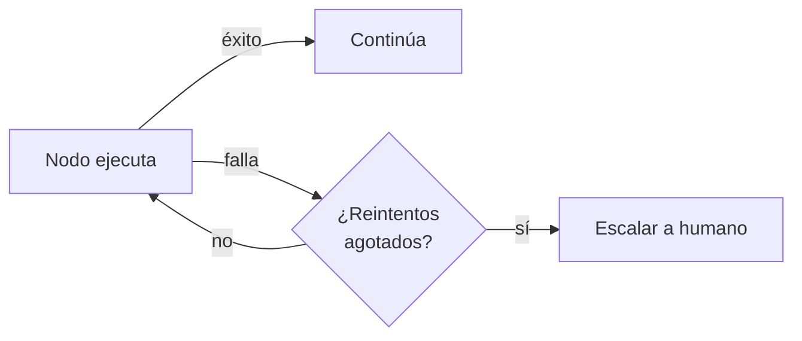

# Módulo 11 — Producción (Semana 11)

!!! abstract "Tema central"
    Costos, latencia, observabilidad con Langfuse, y manejo de fallos cuando el sistema deja de correr solo en la laptop del desarrollador.

## Objetivos de aprendizaje

- [ ] Estimar el costo (o el cómputo, corriendo local) de una ejecución completa del proyecto.
- [ ] Aplicar al menos dos técnicas para reducir latencia percibida (streaming, paralelización).
- [ ] Instrumentar el proyecto con trazas de punta a punta en Langfuse.
- [ ] Definir una política de reintentos con fallback a humano.

## Desglose diario

| Día | Tema |
|---|---|
| 51 | Costos: cómo estimar y controlar gasto en tokens (incluso corriendo local, medir uso de cómputo) |
| 52 | Latencia: streaming, paralelización, timeouts |
| 53 | Observabilidad con Langfuse (self-hosted vía Docker) |
| 54 | Manejo de fallos en producción (retries, fallback a humano) |
| 55 | Práctica: instrumentar el proyecto con trazas |

### Día 53 — Instrumentar con Langfuse

```python
from langfuse.callback import CallbackHandler

langfuse_handler = CallbackHandler(
    public_key="...",
    secret_key="...",
    host="http://localhost:3000",  # instancia self-hosted, ver stack técnico
)

app.invoke(
    {"messages": [("user", "Investigá el estado del mercado de EVs")]},
    config={"configurable": {"thread_id": "demo-1"}, "callbacks": [langfuse_handler]},
)
```

Cada nodo del grafo, cada llamada al modelo y cada tool call queda registrado como un span dentro de una traza — exactamente lo que el Módulo 10 necesita para detectar tool misuse y medir tasa de éxito.

!!! tip "Nodo dice"
    Streaming no reduce la cantidad de tokens ni el tiempo total de generación — lo que mejora es la *latencia percibida*: el usuario ve la respuesta aparecer palabra por palabra en vez de esperar en silencio hasta que esté completa. Vale la pena distinguir "más rápido" de "se siente más rápido", son dos problemas distintos.

### Día 54 — Retries y fallback a humano



!!! tip "No todo fallo merece un reintento automático"
    Un timeout de red se reintenta. Un error de "herramienta inexistente" no — es un bug, y reintentar solo repite el mismo error. Distinguir ambos casos antes de definir la política de retries.

## Videos recomendados

<div class="video-embed" data-yt-id="YWVuBLSbNWE" data-title="LangSmith Deployment GA: The Easiest Way to Deploy Agents"></div>

**[LangSmith Deployment GA: The Easiest Way to Deploy Agents](https://www.youtube.com/watch?v=YWVuBLSbNWE)** — LangChain. Cubre el flujo de deployment de agentes construidos con LangGraph.

Más videos sobre este módulo:

| Video | Canal | Por qué verlo |
|---|---|---|
| [Deep Dive: How to Monitor AI Agents in Production](https://www.youtube.com/watch?v=5yXLZTIqBsU) | — | Explica por qué el monitoreo de agentes en producción requiere un enfoque distinto al del software tradicional. |

!!! note "Sobre los videos de este módulo"
    No se encontró un video que combine específicamente LangGraph + Langfuse en un stack 100% open source (sin nube propietaria); los dos de arriba cubren deployment y monitoreo por separado pero son los más alineados disponibles.

## Notas para el instructor

- Semana de repaso/buffer sugerida.
- El Día 55 continúa la Fase 6 del proyecto, agregando trazabilidad completa con Langfuse.

## Ejercicio práctico

Agregá manejo de reintentos con backoff a la llamada de `app.invoke` del Día 53, con un máximo de 3 intentos ante un error transitorio.

??? success "Ver solución"
    ```python
    import time

    def invocar_con_reintentos(app, entrada, config, max_intentos=3):
        for intento in range(1, max_intentos + 1):
            try:
                return app.invoke(entrada, config)
            except Exception as e:
                if intento == max_intentos:
                    raise
                time.sleep(2 ** intento)  # backoff: 2s, 4s, 8s
    ```

## Autoevaluación

<div class="mc-quiz" markdown>
¿Qué mejora principalmente el streaming?

- [ ] El tiempo total que tarda en generarse la respuesta completa.
- [x] La latencia percibida por el usuario, que ve la respuesta aparecer en vivo.
- [ ] El costo en tokens de la llamada.
</div>

## Checklist de cierre del módulo

- [ ] El proyecto emite trazas completas a Langfuse (visibles en el dashboard local).
- [ ] Existe una estimación documentada de costo/cómputo por ejecución.
- [ ] La política de retries distingue fallos transitorios de errores de bug.
