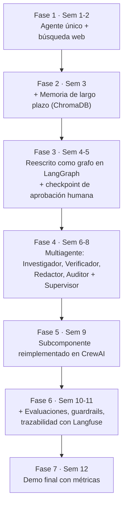

# Proyecto sincrónico: Agencia de Investigación y Reporte Automatizado

Sistema multiagente que investiga un tema, verifica fuentes, redacta y audita un informe final. Todo el grupo trabaja sobre el mismo repositorio, en simultáneo, durante las 12 semanas.

## Por qué este proyecto

- Tiene fases claras que mapean 1:1 con los conceptos del curso (herramientas → memoria → multiagente → evaluación).
- Es demostrable en cada sesión (siempre hay un output visible).
- Escala en complejidad sin cambiar de dominio.

!!! note "Alternativas"
    Si el grupo prefiere otro dominio: soporte al cliente con escalamiento, agente de análisis de datos/BI, o agente de code review. La estructura de fases se mantiene igual, solo cambia el caso de uso.

## Evolución por fases



| Fase | Semana | Descripción |
|---|---|---|
| 1 | 1-2 | Un agente único que responde preguntas y usa una herramienta de búsqueda (DuckDuckGo Search). |
| 2 | 3 | El agente recuerda investigaciones anteriores (memoria de largo plazo con ChromaDB). |
| 3 | 4-5 | Se reescribe como grafo de estados en LangGraph, con un checkpoint de aprobación humana. |
| 4 | 6-8 | Se divide en 3-4 agentes: *Investigador*, *Verificador de fuentes*, *Redactor*, *Auditor*, coordinados por un *Supervisor*. |
| 5 | 9 | Se reimplementa un subcomponente en CrewAI para comparar con el enfoque de LangGraph. |
| 6 | 10-11 | Se agregan evaluaciones automáticas, guardrails y trazabilidad con Langfuse. |
| 7 | 12 | Demo final con métricas de costo, latencia y tasa de éxito. |

## Por qué funciona como hilo conductor

- Cada semana el grupo ve el mismo sistema crecer, no proyectos desconectados.
- Permite comparar "antes/después" al introducir cada concepto (loop manual → grafo → multiagente).
- Da métricas tangibles al final (costo, tiempo, calidad del informe) para cerrar con evaluación real.

## Estructura sugerida del código (a crear durante el curso)

```text
proyecto-sincronico/
├── README.md              (este archivo)
├── fase-1-agente-simple/
├── fase-2-memoria/
├── fase-3-langgraph/
├── fase-4-multiagente/
├── fase-5-crewai/
├── fase-6-evaluacion/
├── fase-7-demo-final/
└── decisiones.md
```

Cada carpeta `fase-N` se crea en la sesión correspondiente, con su propio commit, para dejar historial de la evolución del sistema.

## Registro de decisiones de arquitectura (ADR)

Cada vez que el proyecto cambia de patrón (ej. de pipeline a supervisor), documentar en 2-3 líneas por qué se cambió. Crear estos registros en `proyecto-sincronico/decisiones.md` a medida que ocurran, para enseñar pensamiento de diseño, no solo sintaxis.

**Plantilla sugerida por decisión:**

```markdown
## ADR-00N: <título corto>
- Fecha:
- Contexto: ¿qué problema forzó el cambio?
- Decisión: ¿qué se hizo?
- Alternativas consideradas:
- Consecuencias: ¿qué se gana y qué se sacrifica?
```

## Checklist de avance del proyecto

- [ ] Fase 1 — agente responde y usa búsqueda web
- [ ] Fase 2 — recuerda investigaciones previas
- [ ] Fase 3 — corre como grafo con aprobación humana
- [ ] Fase 4 — 4 agentes coordinados por un supervisor
- [ ] Fase 5 — subcomponente comparado en CrewAI
- [ ] Fase 6 — evaluación automática + trazas en Langfuse
- [ ] Fase 7 — demo con métricas de costo, latencia y éxito
